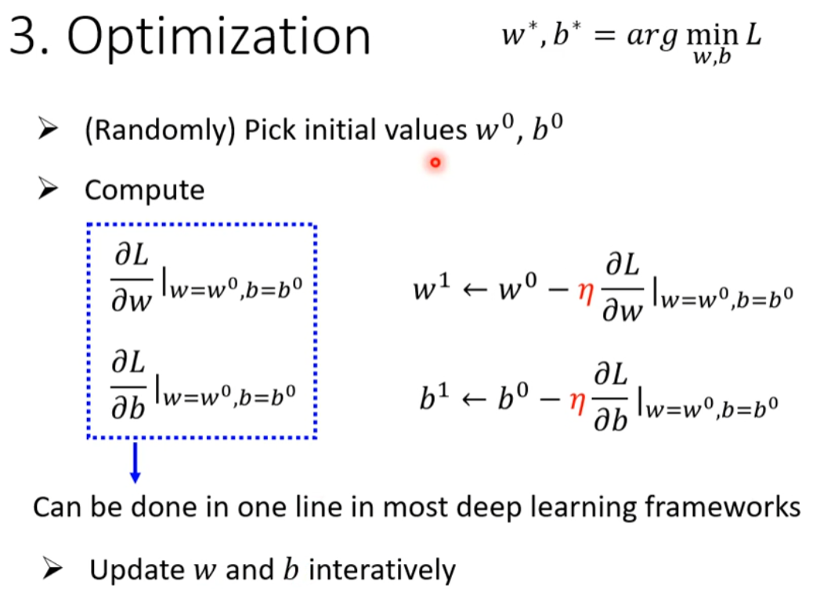

# Machine Learning Fundamentals

## 核心概念
**Machine Learning ≈ Looking for Function**

机器学习的本质是寻找一个函数，该函数能够从输入数据映射到期望的输出。

## 机器学习的三大任务类型

| 任务类型 | 输出类型 | 输出空间 | 典型例子 | 应用场景 |
|---------|---------|---------|---------|---------|
| **回归** | 连续数值 | 实数空间 | 预测房价: $350,000 | 价格预测、温度预测、股票价格等 |
| **分类** | 离散类别 | 有限类别集合 | 图像分类: "猫" | 垃圾邮件检测、医疗诊断、情感分析等 |
| **结构化学习** | 复杂结构 | 结构化空间 | 翻译: "Hello" → "你好" | 机器翻译、语音识别、图像标注等 |

## 机器学习训练流程 (以线性模型为例)

### 步骤一：定义带未知参数的函数
建立模型的数学结构，确定需要学习的参数。

### 步骤二：基于训练数据定义损失函数
通过比较模型预测值与真实值来衡量模型性能。

### 步骤三：优化参数
使用优化算法（如梯度下降）来最小化损失函数，找到最优参数。

## 总结
机器学习的核心流程可以概括为：
1. **模型选择**：确定函数形式和参数结构
2. **损失定义**：建立评估模型好坏的标准
3. **参数优化**：通过算法找到最优参数值

这三个步骤构成了机器学习的基本框架，适用于各种类型的学习任务。

## 模型复杂度提升

### 分段线性函数 (Piecewise Linear)
当线性模型无法很好地拟合数据时，可以使用分段线性函数来增加模型的表达能力。

### Sigmoid 激活函数
Sigmoid函数是一种常用的非线性激活函数，能够将输入映射到(0,1)区间。

## 神经网络架构

### 多特征模型
通过增加更多特征和参数，模型可以学习更复杂的模式。

### 新模型的优化
更复杂的模型需要更sophisticated的优化策略。

### ReLU 激活函数
ReLU (Rectified Linear Unit) 是深度学习中最常用的激活函数之一。

**ReLU函数特点：**
- 简单高效：f(x) = max(0, x)
- 解决梯度消失问题
- 计算速度快

### 多层隐藏层网络
通过堆叠多个隐藏层，神经网络可以学习更加复杂和抽象的特征表示。

## 深度学习 (Deep Learning)
深度学习是机器学习的一个重要分支，使用深层神经网络来学习数据的层次化表示。

**深度学习的特点：**
- **层次化特征学习**：从低级特征到高级抽象特征
- **端到端学习**：直接从原始数据学习到最终输出
- **强大的表达能力**：能够处理复杂的非线性关系

## 总结

### 模型演进路径
1. **线性模型** → 简单但表达能力有限
2. **分段线性** → 增加局部非线性能力
3. **引入激活函数** → 增强非线性表达
4. **多层网络** → 学习复杂特征组合
5. **深度学习** → 端到端的层次化学习