# PyTorch 神经网络训练与测试指南

## 1. 数据加载 (Data Loading)

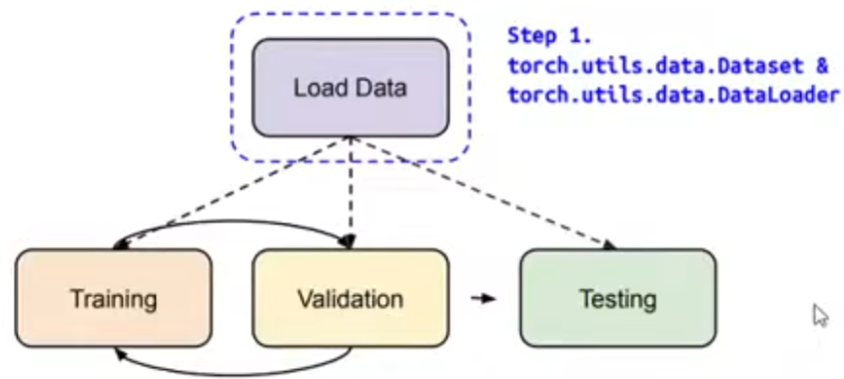
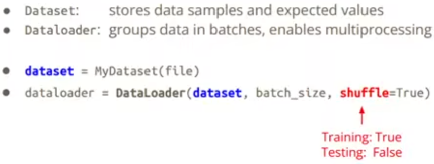
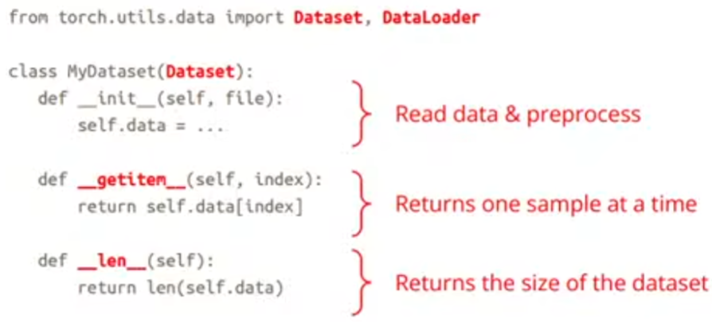
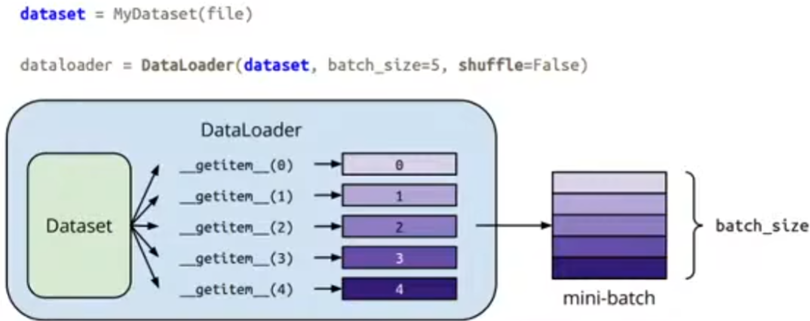

## 2. 张量 (Tensors)

### 2.1 创建张量 (Creating Tensors)
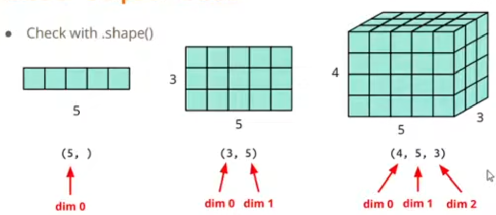

**维度顺序：高宽长**
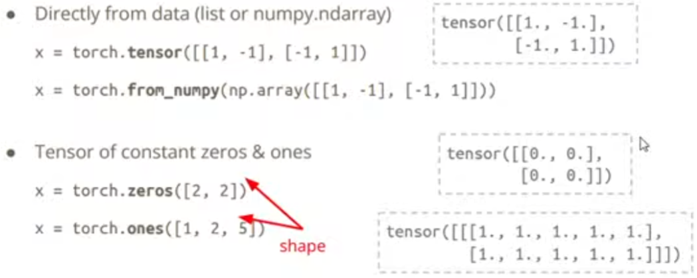

### 2.2 常用操作 (Common Operations)
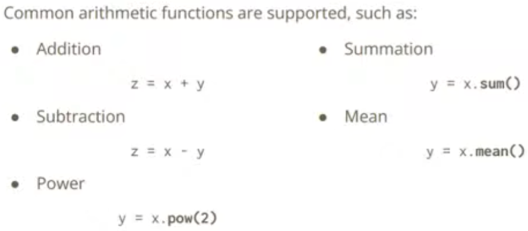
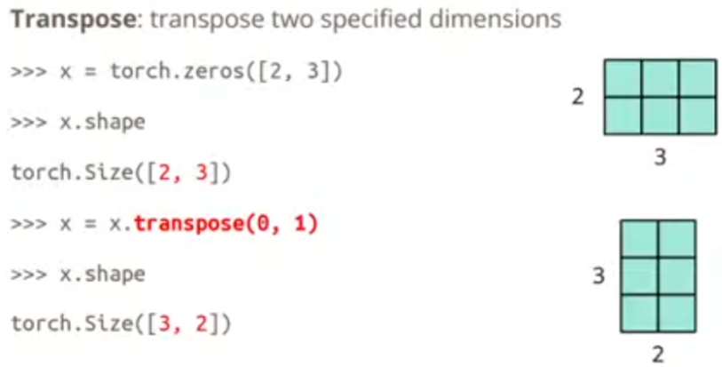
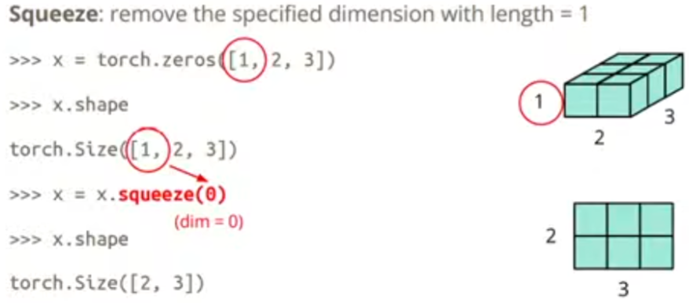
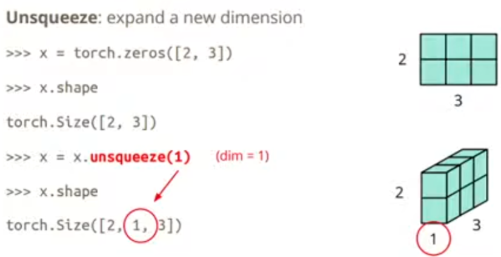
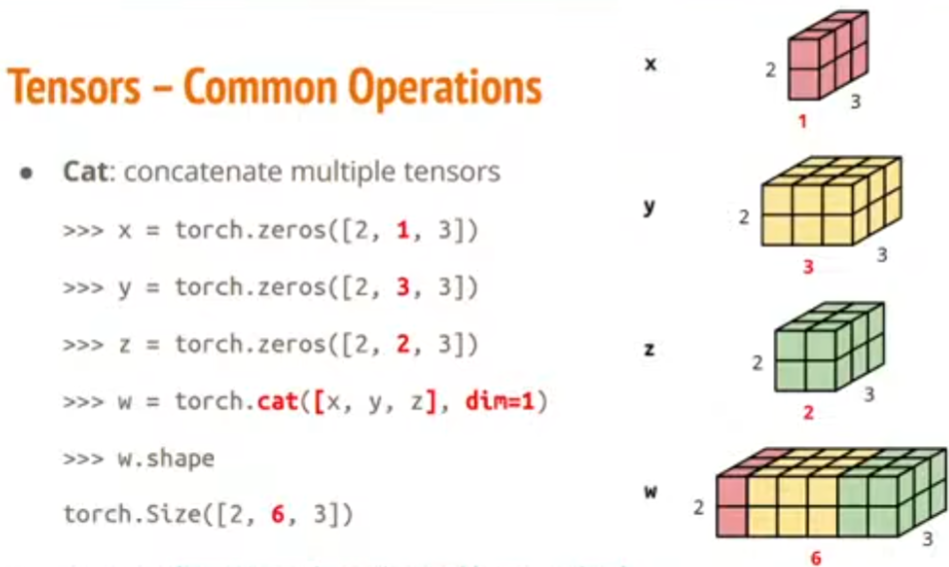

### 2.3 数据类型 (Data Types)
### 2.3 数据类型 (Data Types)

| Data type | dtype | tensor |
|---|---|---|
| 32-bit floating point | torch.float | torch.FloatTensor |
| 64-bit integer(signed) | torch.long | torch.LongTensor |
| 64-bit floating point | torch.double | torch.DoubleTensor |
| 16-bit floating point | torch.half | torch.HalfTensor |
| 8-bit integer(unsigned) | torch.uint8 | torch.ByteTensor |
| 8-bit integer(signed) | torch.int8 | torch.CharTensor |
| 16-bit integer(signed) | torch.short | torch.ShortTensor |
| 32-bit integer(signed) | torch.int | torch.IntTensor |
| Boolean | torch.bool | torch.BoolTensor |

### 2.4 设备选择 (Device Selection)
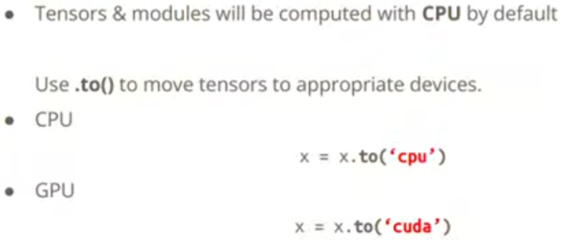

### 2.5 梯度计算 (Gradient Calculation)
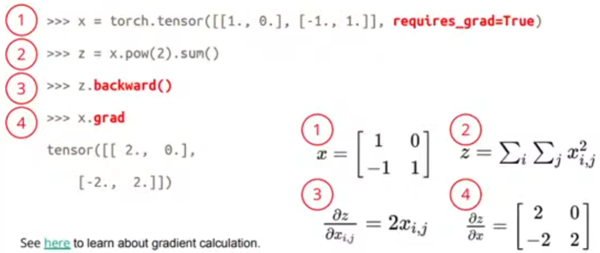

## 3. 神经网络模块 (torch.nn.module)
## 3. 神经网络模块 (torch.nn.module)

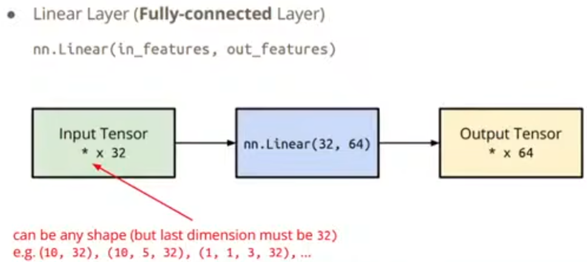
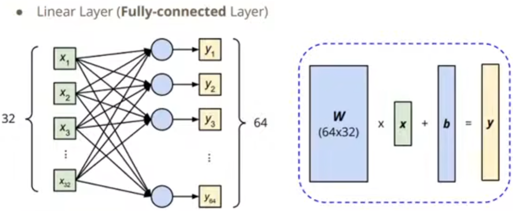
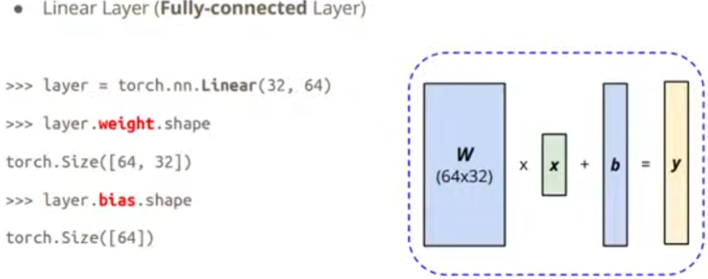
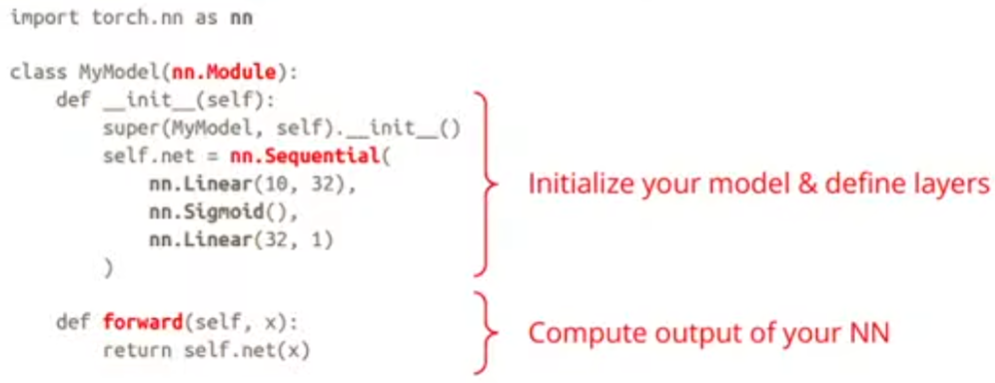
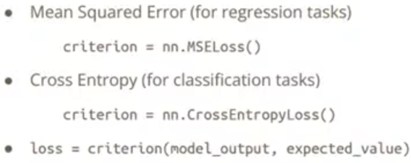
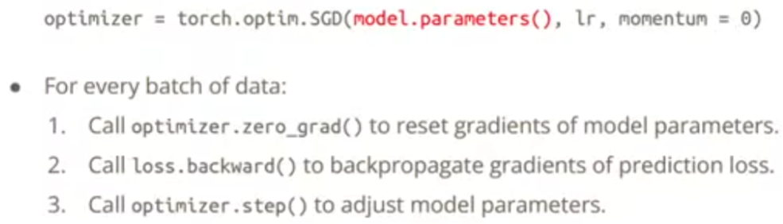

## 4. 神经网络循环 (Neural Network Loops)

### 4.1 训练循环 (Training Loop)
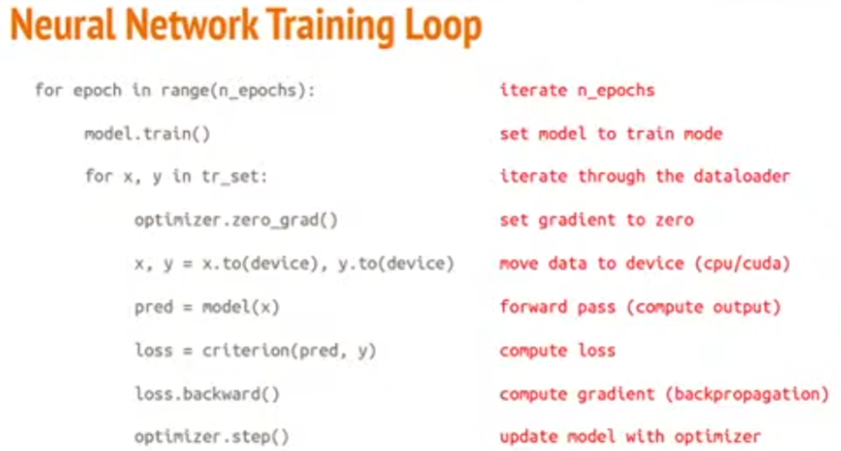

### 4.2 验证循环 (Validation Loop)
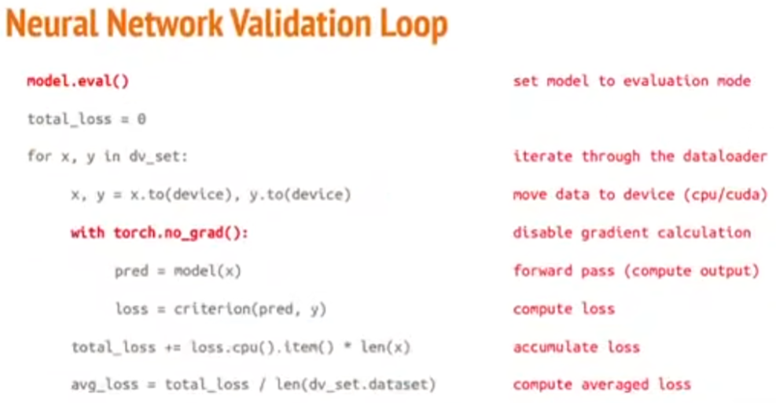

### 4.3 测试循环 (Testing Loop)
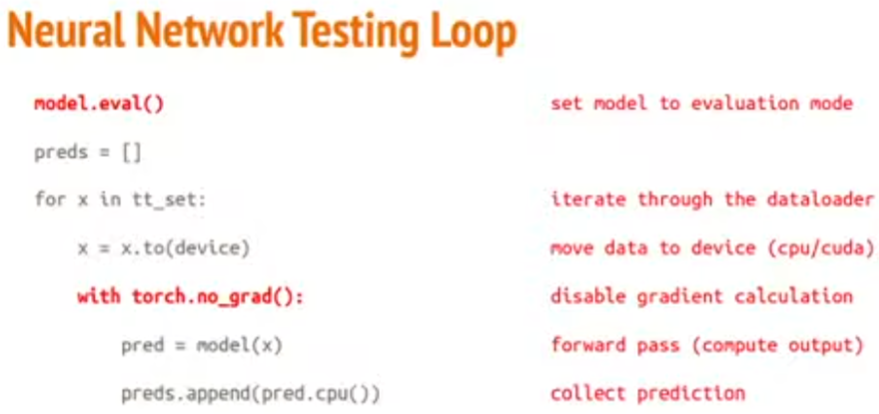

## 5. 模型保存与加载 (Save/Load Trained Model)

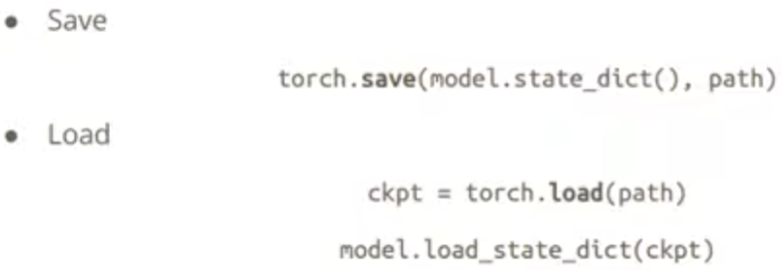