# 机器学习任务攻略

---

## 1. 总体流程
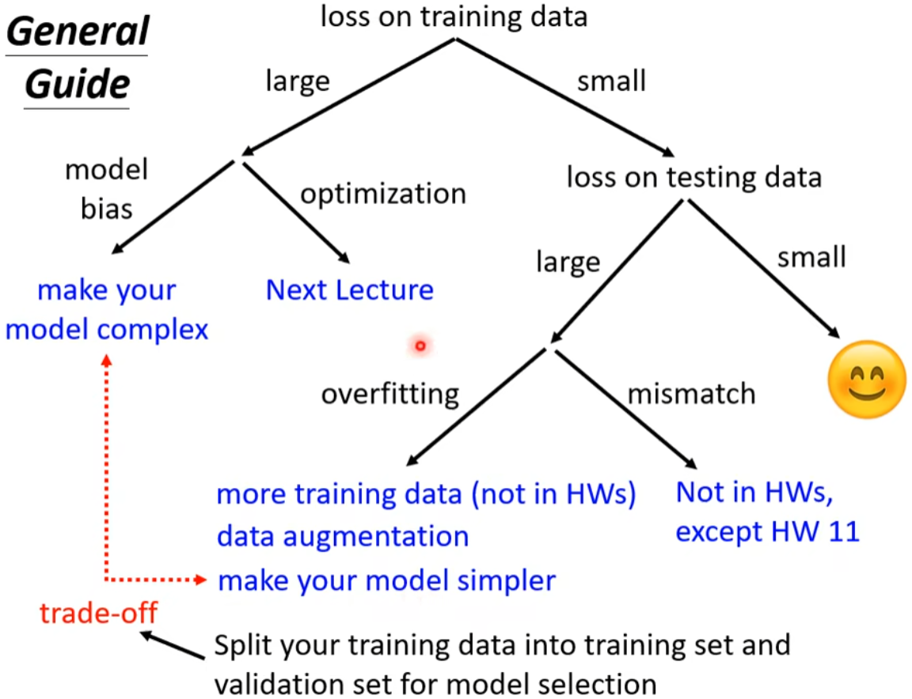

---

## 2. 模型偏差（Model Bias）
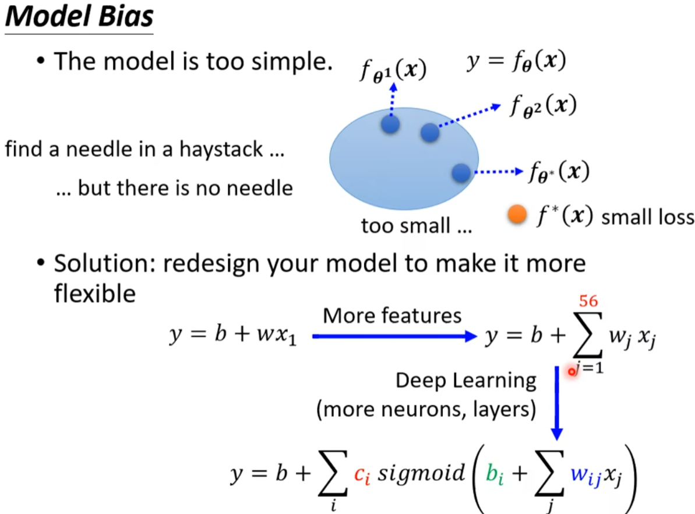

---

## 3. 优化（Optimization）
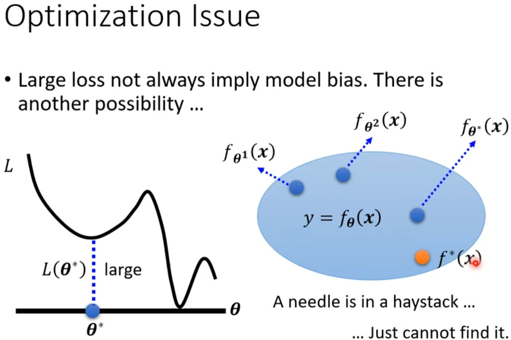
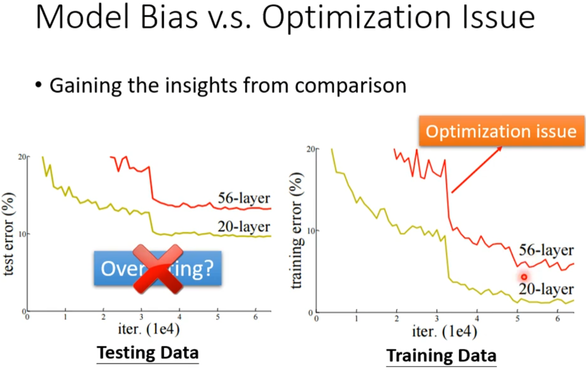
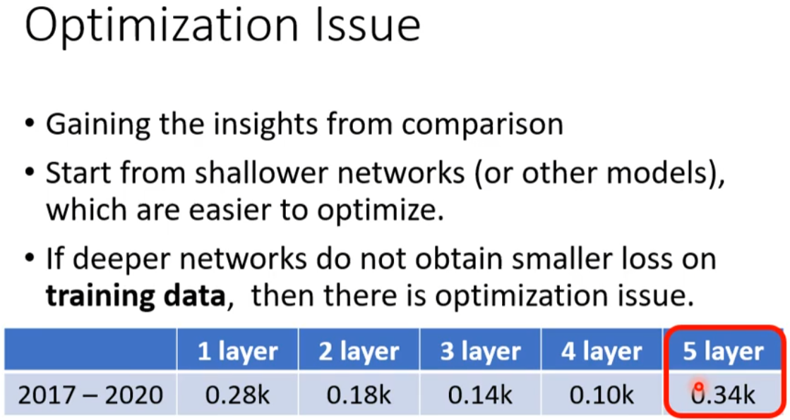

---

## 4. 过拟合（Overfitting）
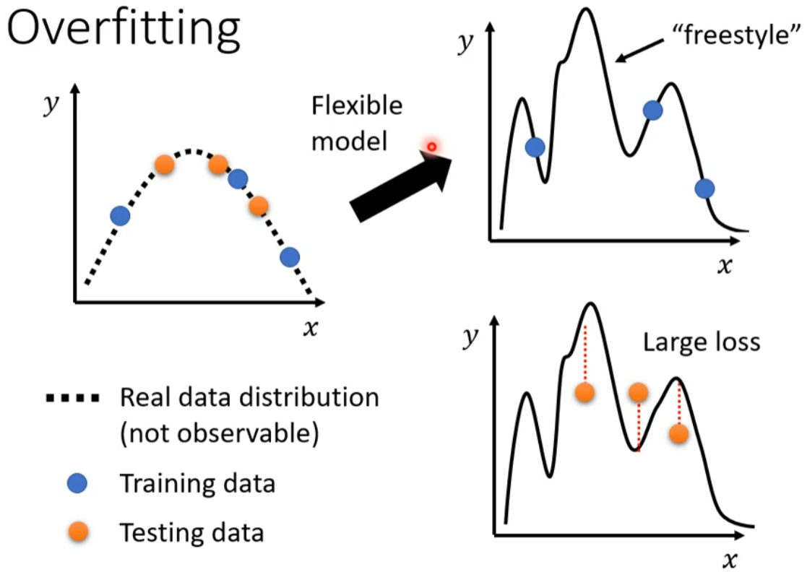
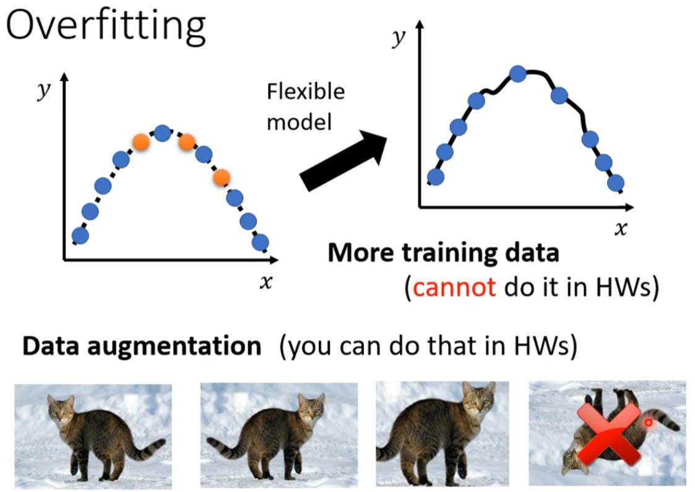
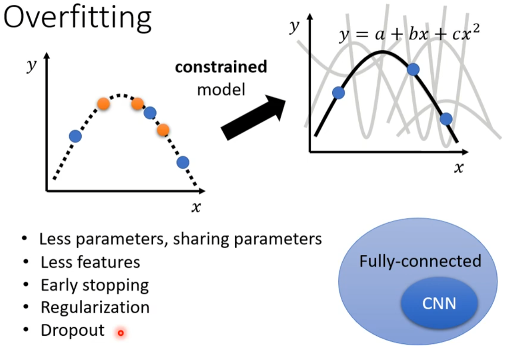
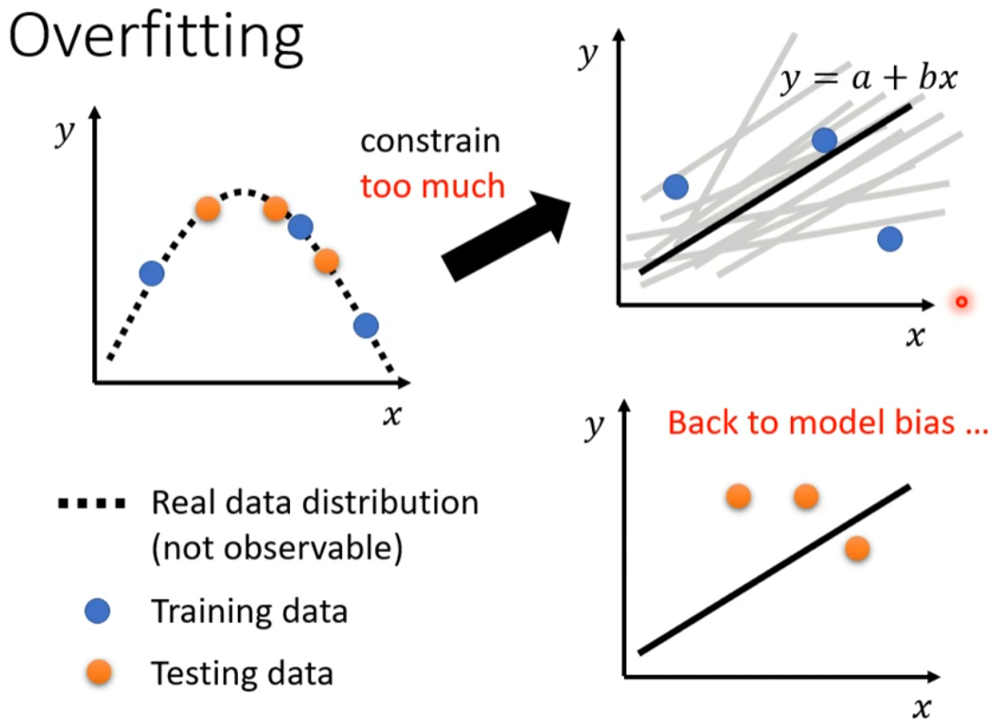

---

## 5. 交叉验证（Cross Validation）

### N折交叉验证（N-fold Cross Validation）
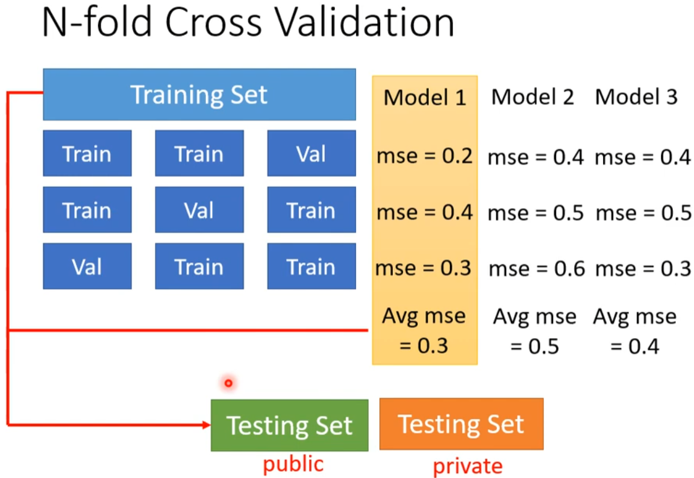

---

## 6. 数据不匹配（Mismatch）
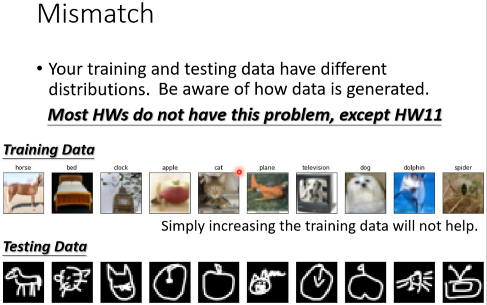