# 卷积神经网络 (CNN) 学习笔记

## CNN的两大简化原理

### 简化1：感受野 (Receptive Field)

**概念**：每个神经元只关注输入的一小部分区域，而不是全部输入。

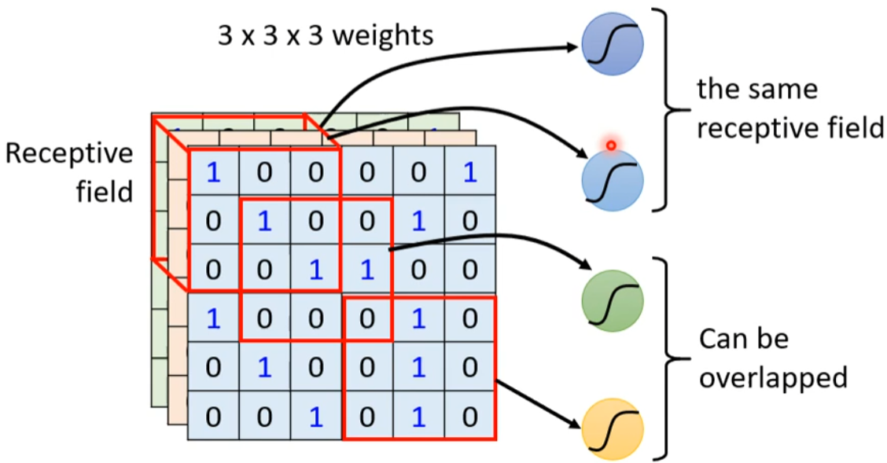

**典型设置**：
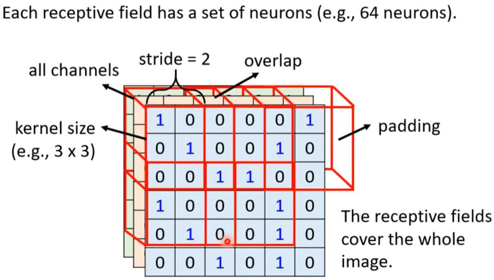

**优势**：
- 减少参数数量
- 保持空间局部性
- 提高计算效率

### 简化2：参数共享 (Parameter Sharing)

**概念**：同一层的所有神经元共享相同的权重参数。

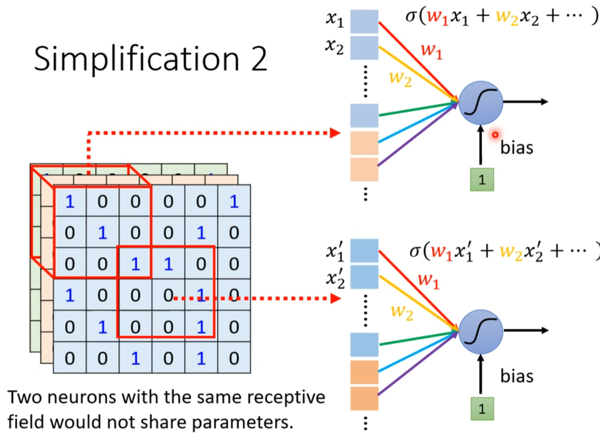

**典型设置**：
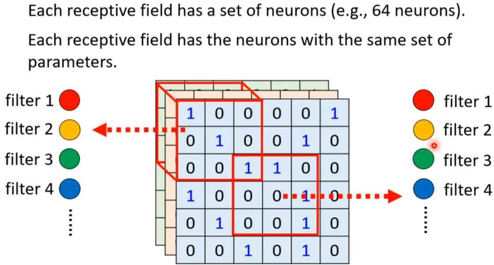

**优势**：
- 大幅减少参数数量
- 平移不变性
- 特征检测一致性

---

## 卷积核 (Filter)

卷积核是CNN中的核心组件，用于特征提取：

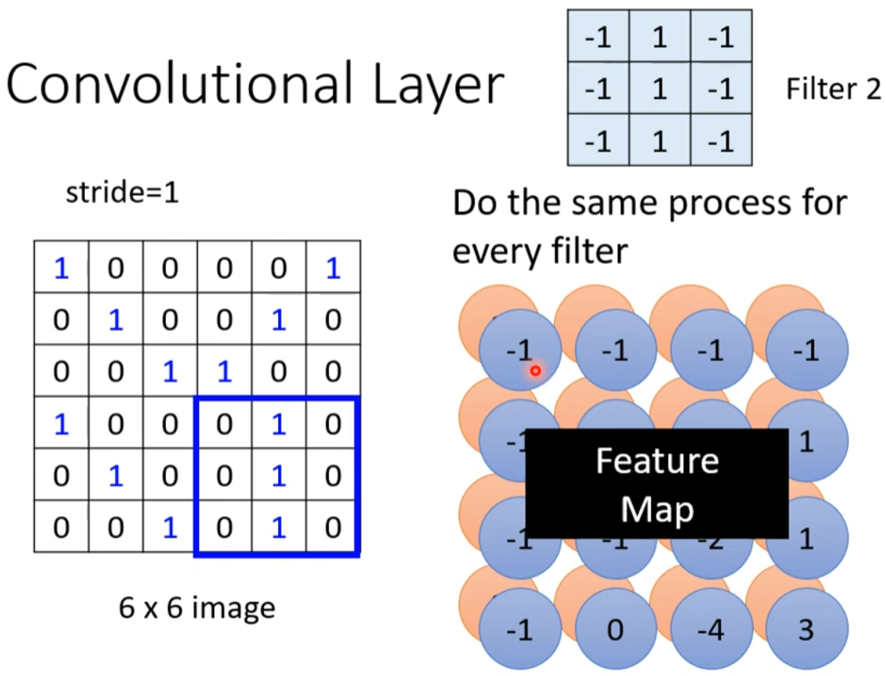
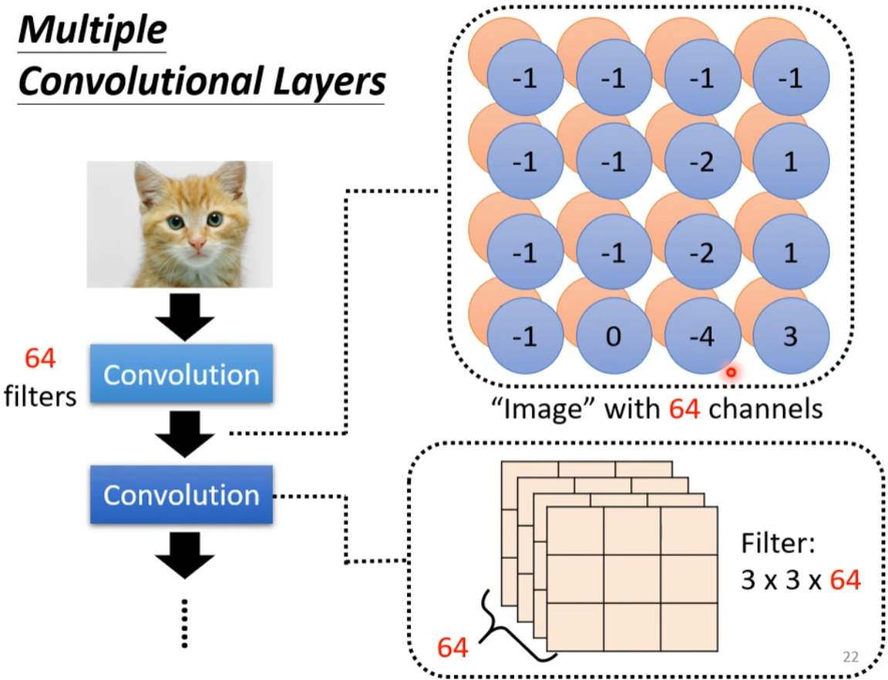
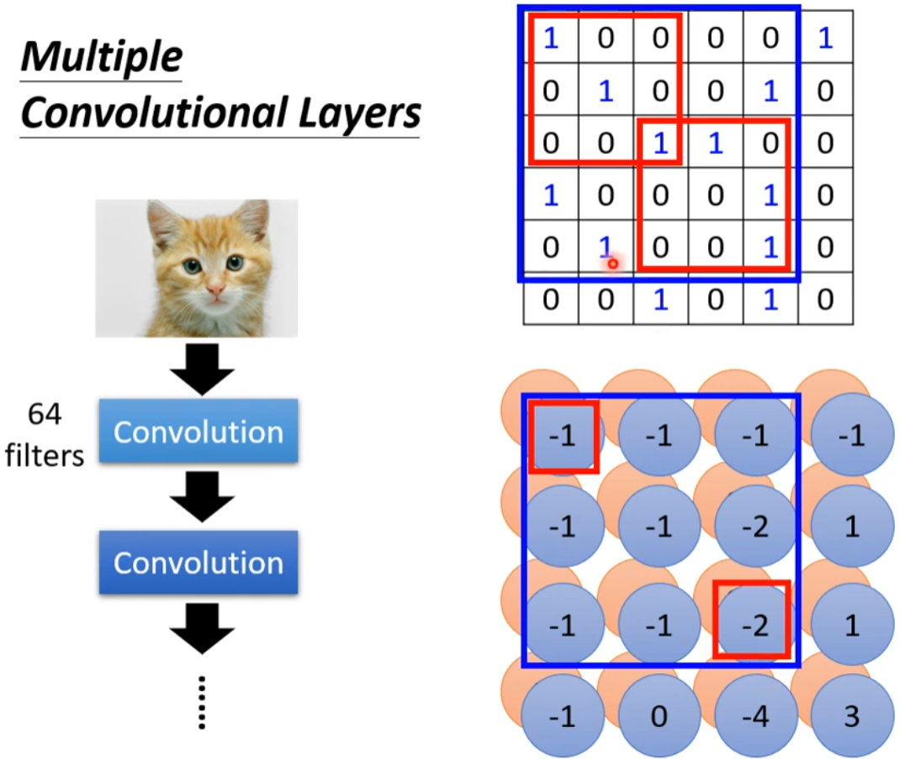

**特点**：
- 小尺寸矩阵（如3×3, 5×5）
- 通过滑动窗口进行卷积操作
- 不同的卷积核检测不同的特征

---

## 感受野与卷积核的对比

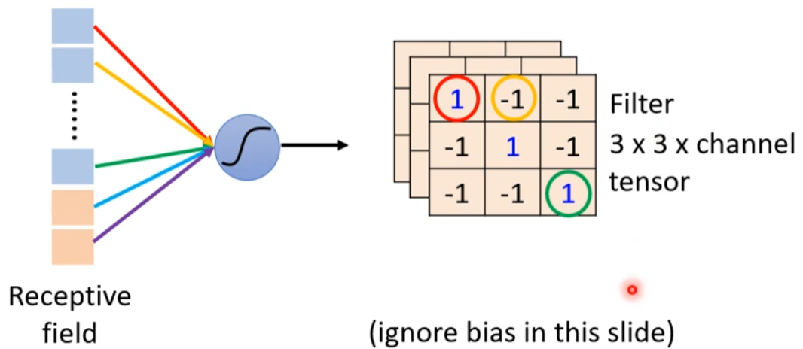
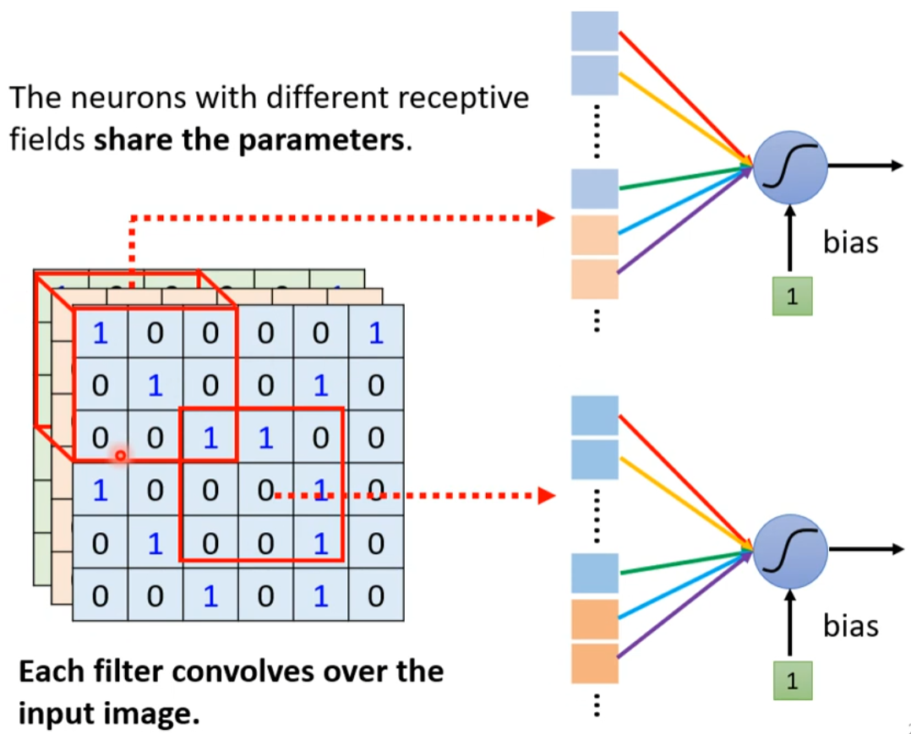

---

## 池化 (Pooling)

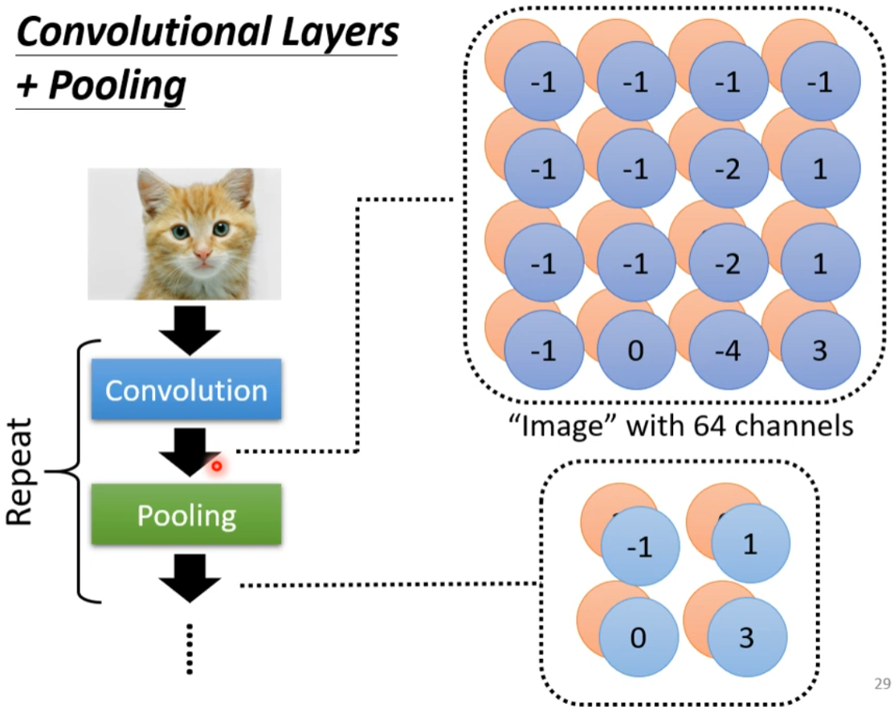

**作用**：
- 降低特征图的空间尺寸
- 减少计算量和参数数量
- 增强模型的平移不变性
- 防止过拟合

**常见类型**：
- 最大池化 (Max Pooling)
- 平均池化 (Average Pooling)

---

## 完整的CNN架构

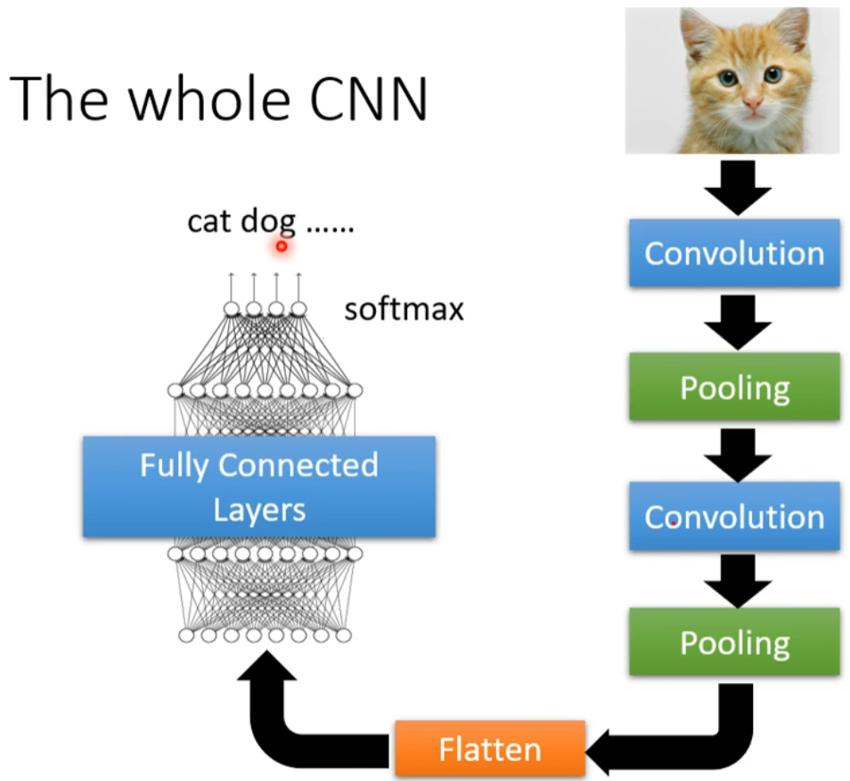

**典型CNN结构**：
1. **输入层**：原始图像数据
2. **卷积层**：特征提取
3. **激活函数**：引入非线性
4. **池化层**：降维和特征选择
5. **全连接层**：分类决策
6. **输出层**：最终结果

**工作流程**：
输入图像 → 卷积+激活 → 池化 → 卷积+激活 → 池化 → ... → 全连接 → 输出