# 循环神经网络 (Recurrent Neural Network, RNN) 学习笔记

## 基础RNN概念

### 1. RNN基本结构
循环神经网络是一种特殊的神经网络，专门用于处理序列数据。它具有记忆功能，能够利用先前的信息来影响当前的输出。

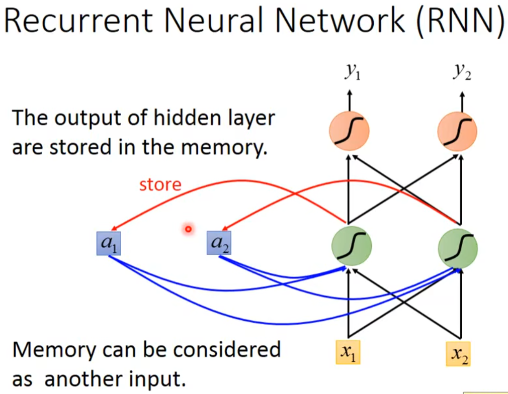

### 2. RNN展开结构
RNN的时间展开形式展示了信息在时间步之间的流动过程。

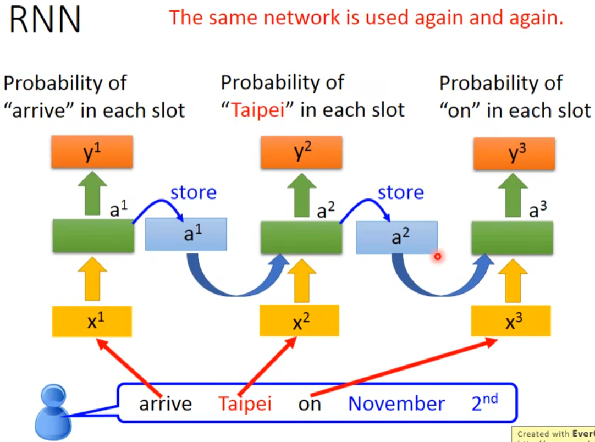

**特点：**
- 参数共享：所有时间步使用相同的权重矩阵
- 序列处理：能够处理可变长度的输入序列
- 记忆机制：隐藏状态保存历史信息

---

## 经典RNN网络类型

### Elman网络 & Jordan网络
两种经典的循环神经网络架构，它们在反馈连接方式上有所不同。

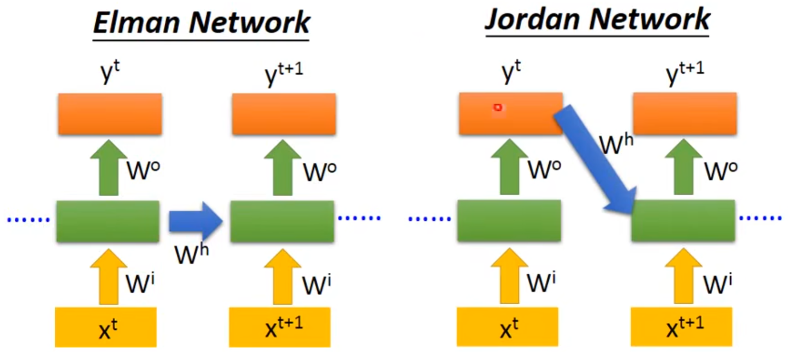

**区别：**
- **Elman网络**：隐藏层到隐藏层的反馈连接
- **Jordan网络**：输出层到隐藏层的反馈连接

---

## 双向RNN

### 双向循环神经网络 (Bidirectional RNN)
双向RNN能够同时利用过去和未来的信息来进行预测，提高了模型的表达能力。

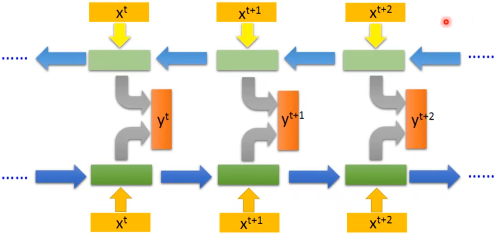

**优势：**
- 利用完整的序列信息
- 更好的上下文理解
- 适用于机器翻译、语音识别等任务

---

## 长短期记忆网络(LSTM)

### 1. LSTM基本概念
LSTM是RNN的一种特殊变体，专门设计来解决传统RNN的梯度消失问题。

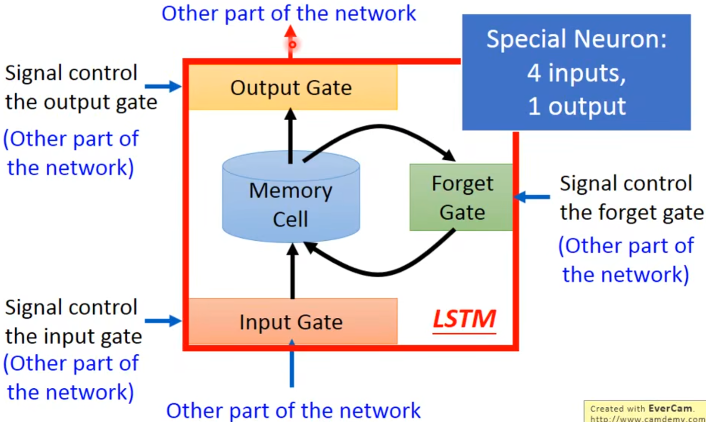

### 2. LSTM门机制详解

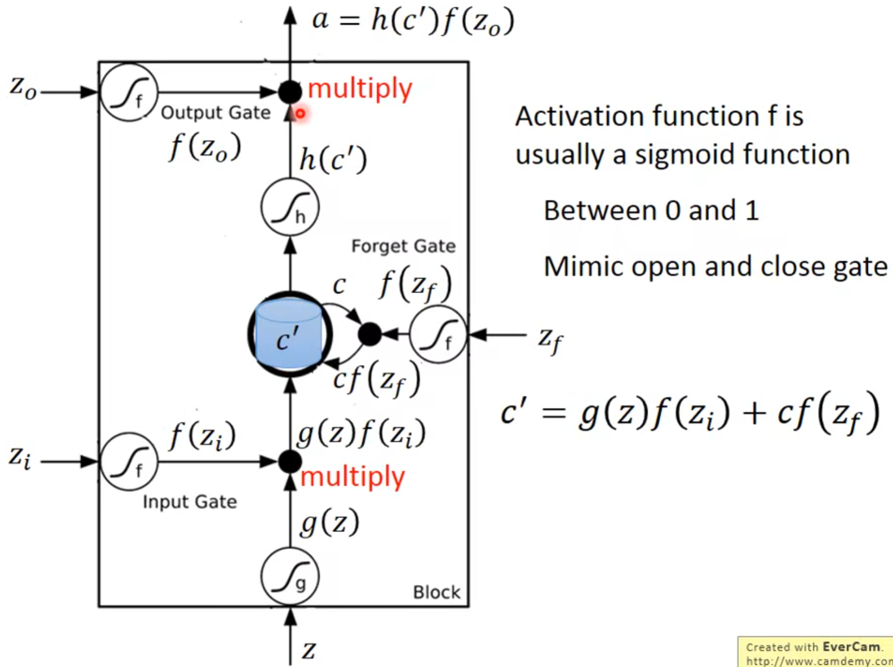

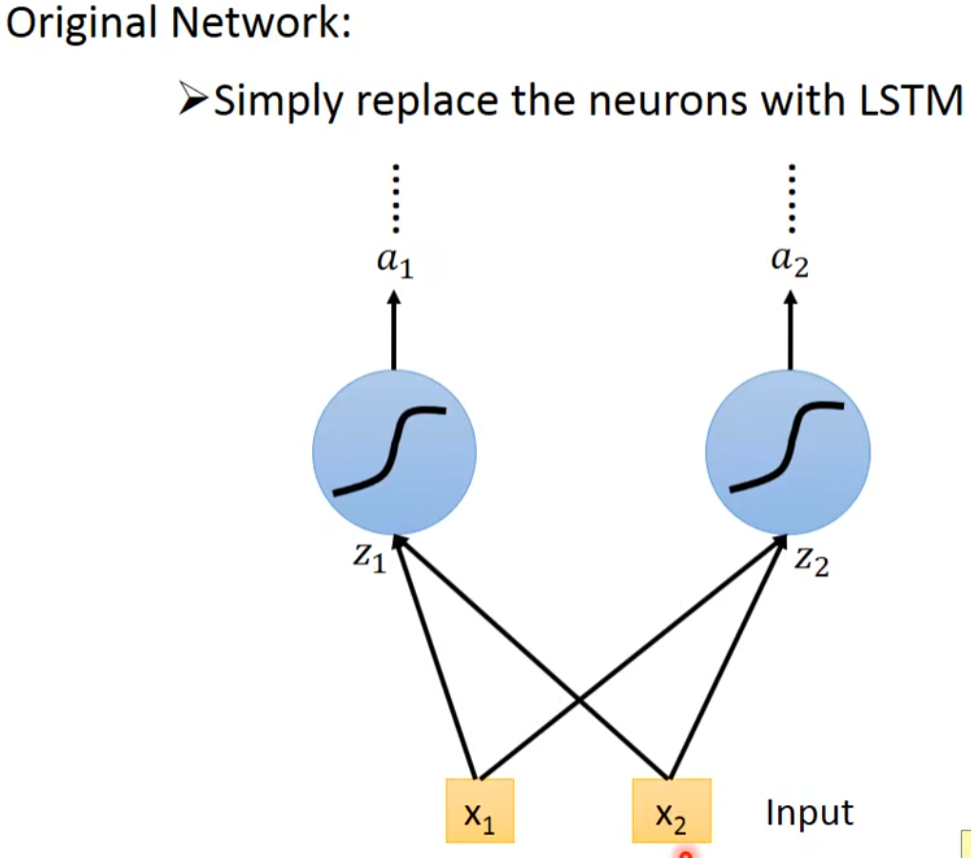

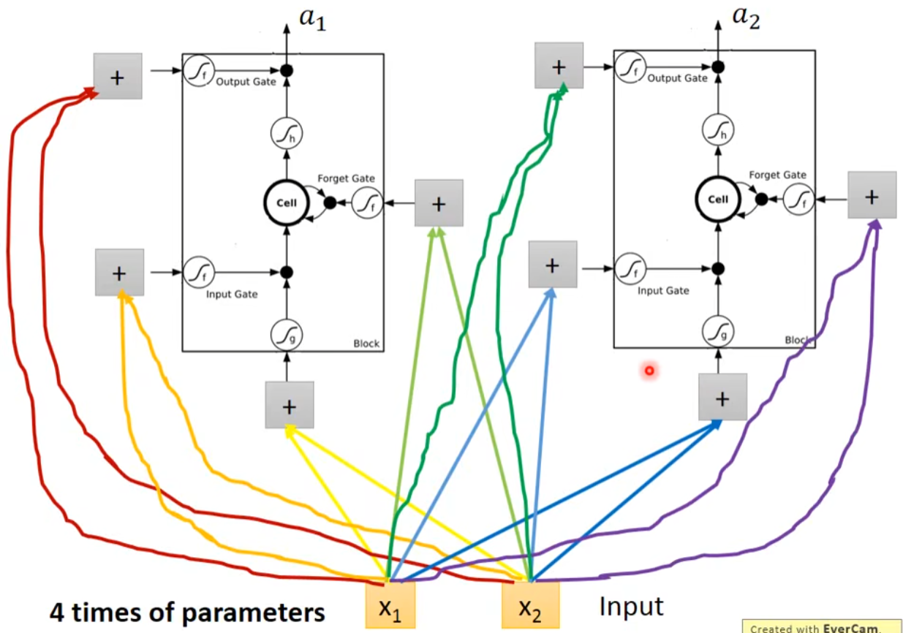

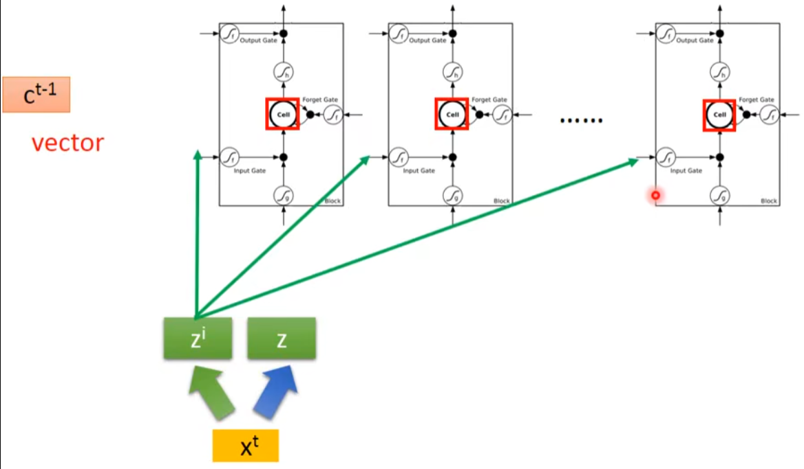

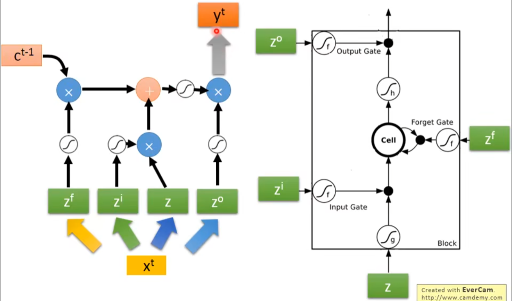

### 4. LSTM网络结构
展示了LSTM在实际网络中的应用结构。

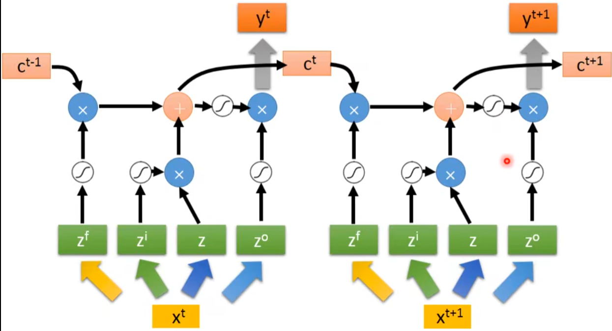

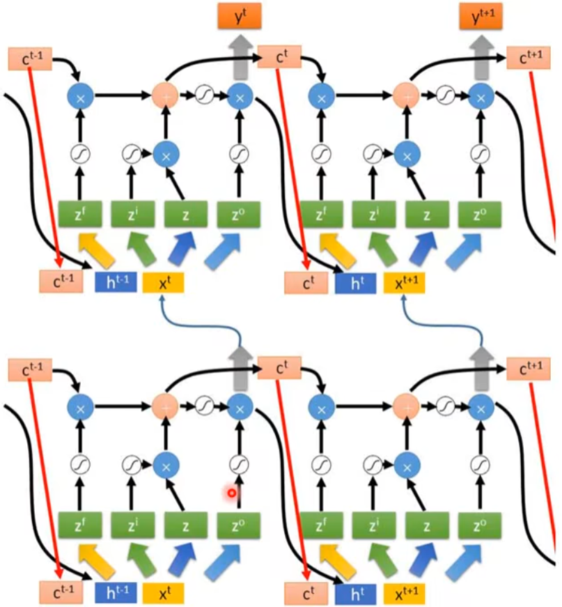

---

## 梯度裁剪(Gradient Clipping)

### 梯度裁剪概念
梯度裁剪是一种防止梯度爆炸的技术，通过限制梯度的最大值来稳定训练过程。

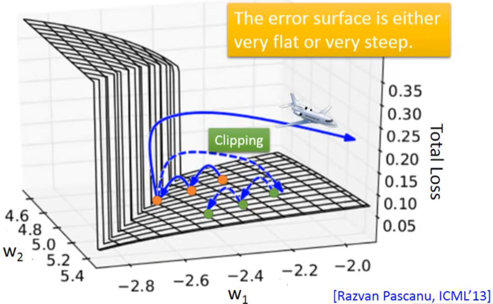

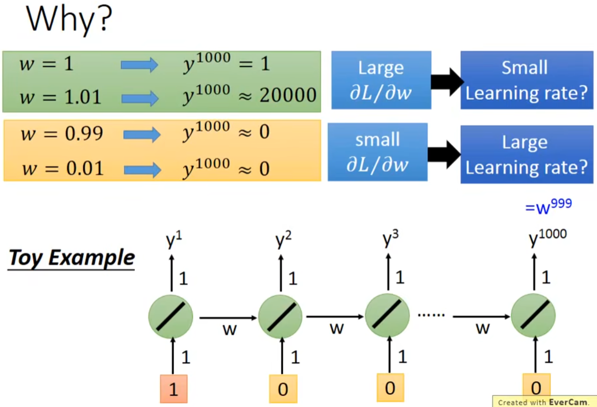

**梯度裁剪的作用：**
- **防止梯度爆炸**：当梯度值过大时，进行裁剪
- **稳定训练**：保持训练过程的稳定性
- **提高收敛性**：有助于模型更好地收敛

---

## 梯度消失问题的解决方案

### 梯度消失问题及其解决方法
传统RNN面临的主要挑战之一是梯度消失问题，这里展示了各种解决方案。

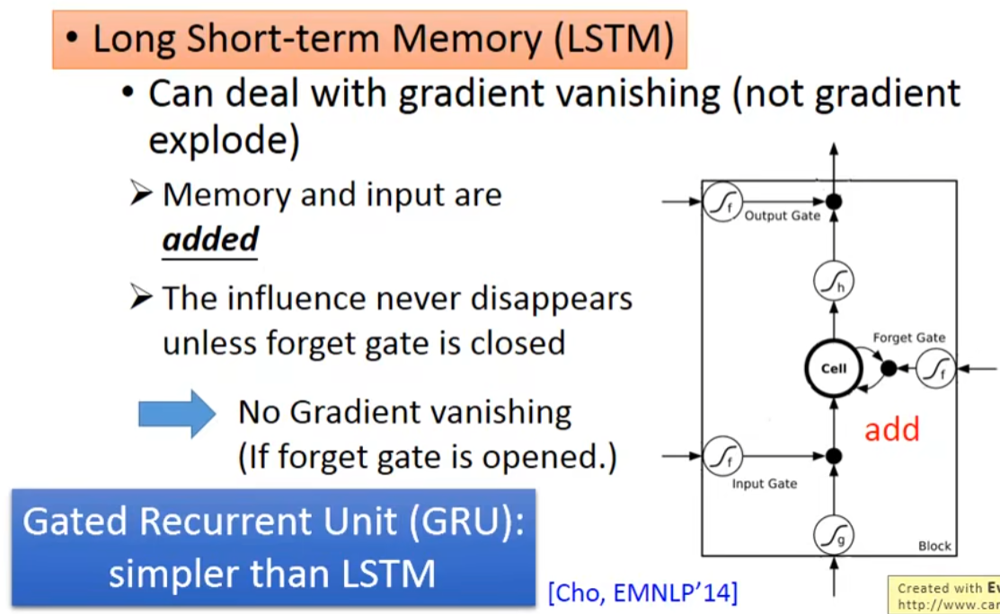

**主要解决方案：**
- **LSTM/GRU**：使用门机制控制信息流动
- **残差连接**：添加跳跃连接
- **梯度裁剪**：防止梯度爆炸
- **合适的初始化**：Xavier或He初始化
- **批归一化**：规范化中间层输出

---

## 注意力机制(Attention Mechanism)

### 注意力机制 v2
注意力机制是现代深度学习中的重要技术，能够让模型专注于输入序列中的重要部分。

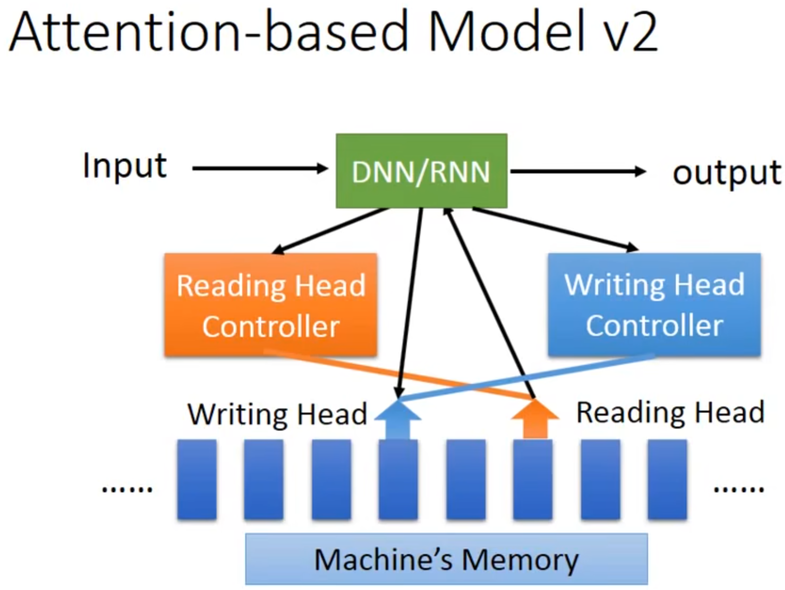

**注意力机制的优势：**
- **选择性关注**：模型可以选择性地关注重要信息
- **长距离依赖**：更好地处理长序列中的依赖关系
- **可解释性**：提供模型决策的可视化解释
- **性能提升**：在许多NLP任务中显著提升性能

---

## 总结

### 重要概念总结

- **梯度消失/爆炸**：深层网络训练中的核心问题
- **门机制**：LSTM的核心创新，控制信息流动
- **注意力权重**：衡量输入各部分重要性的机制
- **序列到序列**：处理输入输出都是序列的任务
- **编码器-解码器**：现代序列处理的标准架构

### 学习要点

1. **理解RNN的时间展开**：掌握参数共享概念
2. **掌握LSTM门机制**：理解如何解决梯度消失
3. **学会梯度裁剪**：防止训练不稳定
4. **理解注意力机制**：现代NLP的基础
5. **实践应用**：在具体任务中应用这些技术