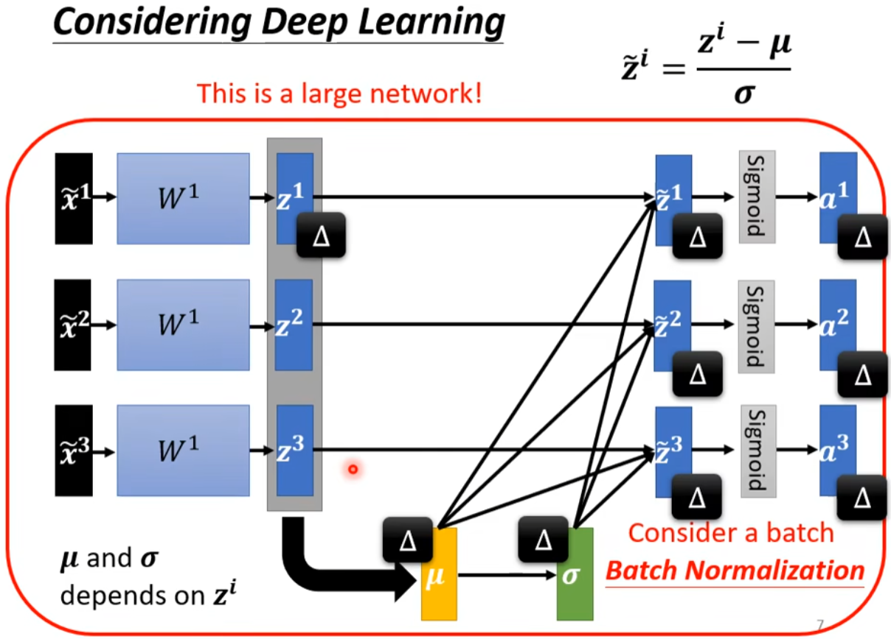

# Batch Normalization 学习笔记

## 1. Changing Landscape:

## 2. Feature Normalization:

## 3. Batch Normalization-Training:

γ 和 β 是需要学习的参数：
- γ：缩放参数，控制方差
- β：偏移参数，控制均值

## 4. Batch Normalization-Testing:
