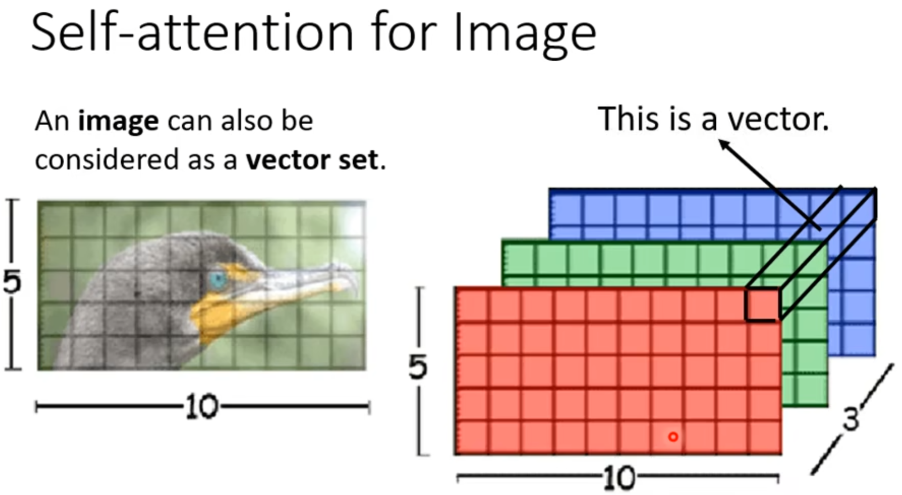

# Self-Attention 机制学习笔记

## 1. 基本概念

### 向量序列作为输入

### 输出结果

## 2. Self-Attention机制

### 基本原理

### 寻找序列中的相关向量

### 矩阵表示方法

## 3. Multi-head Self-attention

## 4. Positional Encoding (位置编码)

## 5. Self-attention的应用

### 语音处理

### 图像处理

## 6. 模型比较

### Self-attention vs CNN

### Self-attention vs RNN

### 图网络应用

