# 知识蒸馏

## 1 知识蒸馏简介

知识蒸馏是指通过教师模型指导学生模型训练，通过蒸馏的方式让学生模型学习到教师模型的知识，最终使学生模型达到或媲美老师模型的准确度。

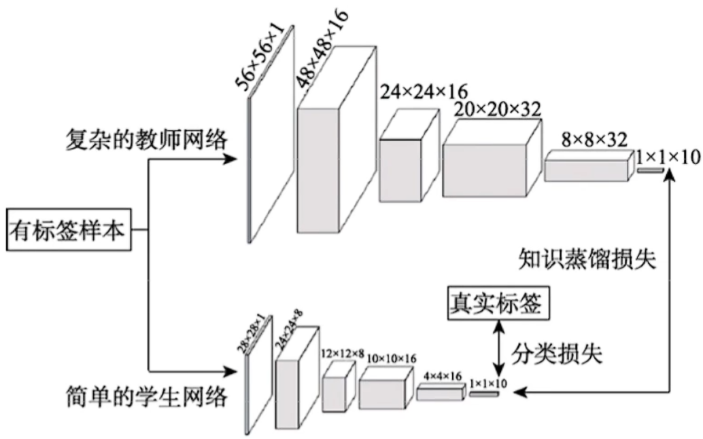

## 2 知识种类

1、输出特征知识

2、中间特征知识

3、关系特征知识

4、结构特征知识

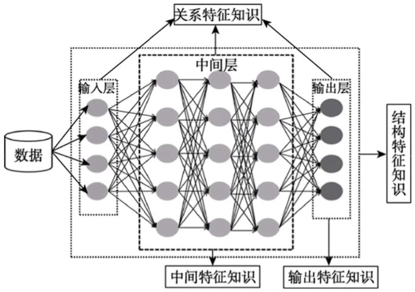

## 3 蒸馏机制

1、离线蒸馏

2、在线蒸馏

3、自蒸馏

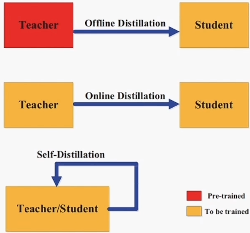

## 4 师生网络架构

学生网络一般是：

1) 教师网络的简化版本，具有较少的层和每层中较少的信道。

2) 教师网络的量化版本，其中网络的结构被保留。

3) 具有高效基本操作的小型网络。

4) 具有优化的整体网络结构的小型网络。

5) 与教师相同的网络。

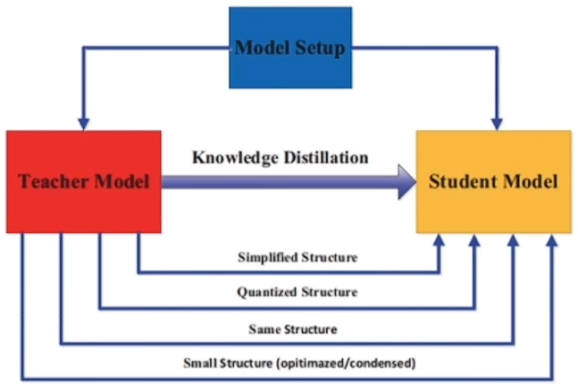

## 5 蒸馏算法

### 5.1 对抗蒸馏

在对抗性学习中，对抗网络中的鉴别器用来估计样本来自训练数据分布的概率，而生成器试图使用生成的数据样本来欺骗鉴别器。受此启发，已经出现了许多基于对抗的知识蒸馏方法，以使教师和学生网络能够更好地理解真实的数据分布。

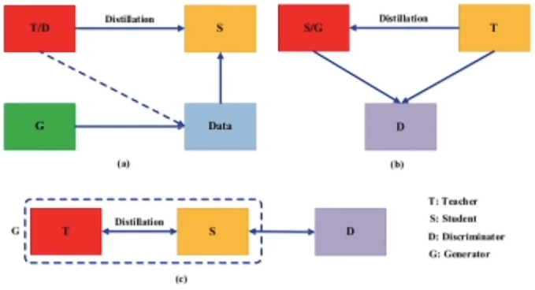

### 5.2 多教师蒸馏

不同的教师架构可以为学生网络提供不同有用的知识。在训练学生网络期间，多个教师网络可以单独地，也可以整体地用于蒸馏。为了传递来自多个教师的知识，最简单的方法是使用来自所有教师的平均响应作为监督信号。

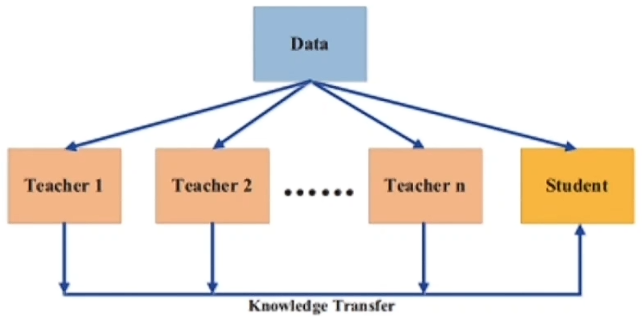

### 5.3 交叉模式蒸馏

在训练或测试期间，某些数据或标签可能不可用。因此，在不同的模型之间传递知识是很重要的。然而，当模型存在差异时，跨模型知识蒸馏是一项具有挑战性的研究，例如，当不同模式之间缺乏配对的样本时。

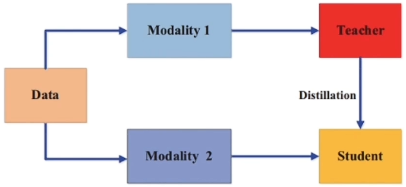

### 5.4 基于图的知识蒸馏

基于图的蒸馏方法的主要思想是：

1、用图作为教师知识的载体；

2、用图来控制教师知识的信息传递。

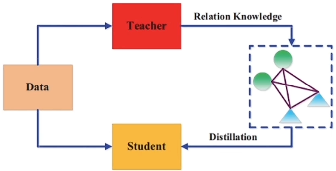

### 5.5 无数据蒸馏

为了克服由隐私、合法性、安全性和保密性问题等原因引起的不可用数据的问题，出现了一些无数据知识蒸馏的方法。无数据蒸馏中的合成数据通常是从预训练教师模型的特征表示中生成的。

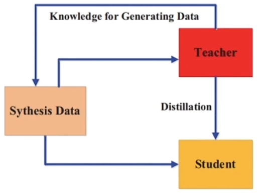

### 5.6 量化蒸馏

一个大的高精度的教师网络将知识传递给一个小的低精度的学生网络。为了确保小的学生网络精确地模仿大的教师网络，首先在特征图上量化教师网络，然后将知识从量化的教师转移到量化的学生网络。

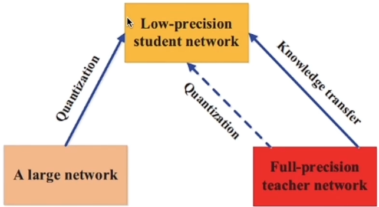

## 6 蒸馏流程

step1：训练Teacher 模型。

step2：利用高温T产生Soft-target，用T=1产生Hard-target。

step3：利用{高温T，Soft-target}和{T=1，Hard-target}同时训练Student模型。

step4：设置T=1，Student模型线上做推理。

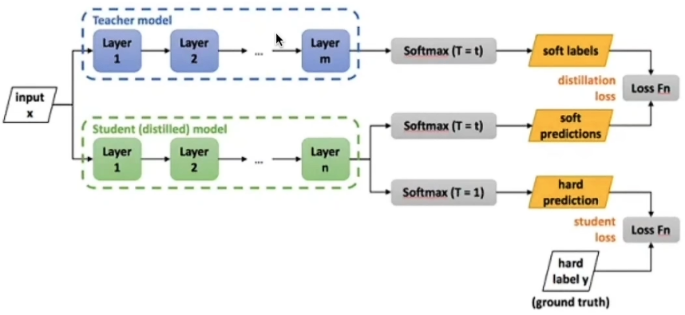

### 6.1 高温蒸馏与损失函数

- 我们把步骤2和步骤3统一称为：高温蒸馏的过程。

- 总损失形式：

  $L = \alpha L_{\mathrm{soft}} + \beta L_{\mathrm{hard}}$

- 对于一个包含 $N$ 个样本的数据集，按样本平均：

  $L = \frac{1}{N} \sum_{n=1}^N \left[ \alpha L_{\mathrm{soft}}(x_n) + \beta L_{\mathrm{hard}}(x_n) \right]$

- 硬目标损失（Hard-target）：

  $L_{\mathrm{hard}} = -\sum_i y_i \log a_i$  
  其中 $a_i$ 是学生在 $T=1$ 时的 softmax 输出（对应第 $i$ 类）。

- 软目标损失（Soft-target，高温 $T$）：

  $L_{\mathrm{soft}} = -\sum_i p_i^{T} \log q_i^{T}$  
  其中 $p_i^{T}$ 是教师在温度 $T$ 下的 softmax 输出，$q_i^{T}$ 是学生在温度 $T$ 下的 softmax 输出。

- softmax（温度 $T$）定义：

  $p_i^{T} = \dfrac{\exp(z_i^t / T)}{\sum_j \exp(z_j^t / T)}$  
  
  $q_i^{T} = \dfrac{\exp(z_i^s / T)}{\sum_j \exp(z_j^s / T)}$

