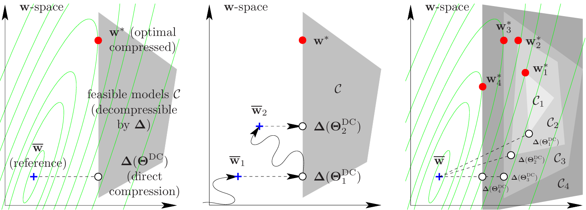

# Model compression as constrained optimization, with application to neural nets. Part I: general framework
- 作者：Miguel A. Carreira-Perpiñán
- arXiv:1707.01209v1 [cs.LG], 5 Jul 2017 (提交日期 July 4, 2017)
- 机构：UC Merced, Electrical Engineering and Computer Science

## Abstract
- 论文把模型压缩统一为一个约束优化问题（constrained optimization），该形式可覆盖量化、低秩、剪枝、无损压缩等多种压缩方法。
- 提出了基于增广拉格朗日（augmented Lagrangian）和交替优化的通用算法，称为 Learning–Compression (LC) 算法：交替进行“学习步骤”（不依赖压缩类型）和“压缩步骤”（只对参数做压缩），既简单又高效。
- 在标准假设下，算法能局部最优地找到针对任务的压缩模型。
- 论文为通用框架的第 I 部分；针对量化、剪枝等具体技术在后续配套论文中展开并给出实验结果。

## 1 Introduction
- 深度神经网络在许多任务上取得优秀效果，且随着数据量增长，模型规模也在持续增大（参数从百万增长到数亿、数十亿）。
- 大模型训练通常在资源丰富的环境（GPU、服务器）完成，但部署目标（移动设备、嵌入式）资源受限（内存、计算、能耗、带宽），因此需要压缩模型以便部署。
- 已有两点经验事实：
	- 大型神经网通常含有显著冗余，可被压缩为更小的网络而保持精度；
	- 通常先训练大模型再压缩，效果优于直接训练小模型（为何如此尚无完全理论解释）。
- 现有方法多是针对某一压缩技术的专门算法，存在两方面的局限：方法偏专门化、缺乏关于在给定压缩形式下是否最优的保证。
- 本文目标：给出能容纳多种压缩形式的统一数学表述，并设计通用训练算法（LC），该算法把压缩机制作为黑盒，交替执行学习与压缩，并在一定条件下保证局部收敛到最优的压缩模型。

## 2 Related work: what does it mean to compress a model?
 - 广义上把模型压缩理解为用一个“较小”模型替换“大”模型以完成相同任务。文中以分类问题举例：大模型 $f(x; w)$（参数 $w \in \mathbb{R}^P$）与小模型 $h(x; \Theta)$（参数 $\Theta \in \mathbb{R}^Q$, $Q < P$）。
- 构造小模型 h 的方式主要有：
	1. 直接学习（Direct learning）：直接最小化小模型的任务损失 $\min_{\Theta} L(h(x; \Theta))$，有时效果最好，但不总是最优。
	2. 直接压缩（Direct compression, DC）：直接逼近大模型参数，例如最小化 $\|w - \Delta(\Theta)\|^2$，把 $\Delta(\Theta)$ 看作低维参数到原始参数的映射；该方式忽略任务损失，可能并非任务最优。
	3. 把模型压缩表述为带约束的优化（本文方法）：强制 $w = \Delta(\Theta)$ 的结构同时最小化任务损失 $L$，从而在参数结构限制下直接优化任务目标。
	4. 教师-学生（Teacher-student）：用大模型生成更多带标签的数据再训练小模型（或在输出概率上做变换）；优点是可扩充数据，但从压缩比角度常不突出且依赖用户设计学生结构。
- 多数现有压缩技术属于上述某一类或其组合：低精度表示（binary/ternary/定点/幂次量化）、量化（软/硬）、剪枝（稀疏化）、低秩分解、哈希、无损编码（如 Huffman）等，许多工作会组合多种技术以获得更高压缩率（例如剪枝+量化+Huffman）。
- 论文指出，将在配套文章中对量化、剪枝等具体压缩技术给出基于该通用框架的算法和实验评估。

## 3 A constrained optimization formulation of model compression

- 本节核心观点：把模型压缩视为在高维参数空间中对参数的低维参数化约束下求解任务损失的约束优化问题。
- 设参考（大）模型为 $f(x; w)$，参数 $w\in\mathbb{R}^P$ 已在损失 $L(\cdot)$（记作 $L(w)$）下训练得到（可为局部最小）。压缩即寻求一个低维参数 $\Theta\in\mathbb{R}^Q$（$Q<P$），通过解压映射 $\Delta(\Theta)$ 构造出 $w$，得到压缩模型 $h(x;\Theta)=f(x;\Delta(\Theta))$，并希望其在任务损失上局部最优。
- 直接在 $\Theta$ 空间上直接学习的做法是 $\min_{\Theta} L(\Delta(\Theta))$（即 Direct learning），但文章提出等价并更便于算法设计的带约束形式：

- 约束优化形式（公式 (1)）：$\min_{w,\Theta} L(w)\quad\text{s.t.}\quad w=\Delta(\Theta)$。



图1：模型压缩示意。绿色为损失等高线，灰色为由解压映射 $\Delta$ 定义的可行集 $\mathcal{C}$；图中标出参考模型 $w$（不可行）、直接压缩点 $w_{\mathrm{DC}}=\Delta(\Theta_{\mathrm{DC}})$（可行但未必在 $\mathcal{C}$ 上最优）以及最优压缩点 $w^{\ast}=\Delta(\Theta^{\ast})$（在 $\mathcal{C}$ 上的局部最优）。子图展示多个局部极小值与不同压缩等级对应的可行集 $C_1,C_2,\dots$。
- 这样写的好处是把“学习任务”部分（目标中的 $L(w)$）和“压缩/参数化”部分（约束 $w=\Delta(\Theta)$）明显分离，便于交替优化设计（Learning–Compression，LC）。

- 进一步说明直接学习为何不总是首选：
	- 若 $\Delta$ 对 $\Theta$ 不可微（如硬量化），基于链式法则的梯度法不可行；
	- 在低维 $\Theta$ 空间上直接优化可能更易陷入局部最优或收敛较慢；
	- 直接学习无法充分利用在 $w$ 空间中训练得到的大模型信息；
	- 直接学习会把损失设计与压缩方法耦合，使算法专门化，而 LC 通过分离二者可复用性更强。

### 3.1 Compression as orthogonal projection on the feasible set

- 定义压缩映射（压缩算子）为
	$\Pi(w)=\arg\min_{\Theta}\|w-\Delta(\Theta)\|^2$，
	即把 $w$ 映射到能被 $\Delta$ 解压得到的最近的可行低维表示 $\Theta$。
- 这等价于在可行集合 $\mathcal{C}=\{w\in\mathbb{R}^P:\,w=\Delta(\Theta)\text{ for some }\Theta\}$ 上做欧氏正交投影，因而可把壓縮視為找離 $w$ 最近的可行點。
- 注意：$\Pi$ 通常满足 $\Pi(\Delta(\Theta))=\Theta$（先解压再压缩可回到原 $\Theta$），但 $\Delta\circ\Pi$ 不必为恒等（lossy 情况下）。若是无损压缩，则 $\Pi=\Delta^{-1}$。

### 3.2 Types of compression

- 低秩（Low-rank）：将权重矩阵 $W$ 表示为 $\Delta(U,V)=UV^T$（$U\in\mathbb{R}^{m\times r},V\in\mathbb{R}^{n\times r}$），$r<\min(m,n)$；压缩映射可由 SVD 或线性方程给出。
- 量化（Quantization）：将每个权重映射到 $K$ 个码本值之一；若同时学习码本与分配，可用 k-means；固定码本则用四舍五入/取符号（例如二值化 $\{\pm1\}$）。
- 低精度近似（Low-precision）：对每个权重施加 $w_i=\theta_i$ 形式的约束，$\theta_i$ 为截断/量化后的表示（例如单精度/半精度），二值化为 $\theta_i=\operatorname{sgn}(w_i)$。
- 剪枝（Pruning）：约束某些参数为 0（稀疏），压缩映射通过阈值或裁剪实现。
- 无损压缩（Lossless）：例如 Huffman 编码，$\Delta$ 为双射，此时直接压缩就能得到最优解，LC 非必需。
- 可组合多种技术；压缩等级可调（例如秩 r 或码本大小 K），实际空间占用需同时计入解压所需数据（码本、索引等）。
- 该框架支持对模型不同部分使用不同压缩方法（分段约束 $w_j=\Delta_j(\Theta_j)$），并行处理。

### 3.3 Other formulations of model compression

- 惩罚形式（penalty）：可写为 $\min_w L(w)+\lambda C(w)$，其中 $C(w)$ 鼓励 $w$ 接近可压缩形式。通过引入 $\Theta$ 并重复变量，可得
	$\min_{w,\Theta} L(w)+\lambda C(\Theta)\ \text{s.t.}\ w=\Theta$，从而仍可交替优化。但惩罚式通常不能保证解为精确压缩模型（只保证接近），因此需最后舍入，可能导致次优。对某些情形（如稀疏惩罚）惩罚式可直接获得精确压缩，但约束式在实际上更直观可控（例如直接指定非零个数）。
- 另一个可行的约束式是直接用压缩映射 $\Pi$：$\min_{w,\Theta} L(w)\ \text{s.t.}\ \Pi(w)=\Theta$（公式 (5)）。该表述的缺点是约束对 $w$ 无限制（可直接设 $w$ 为参考模型最优点并取 $\Theta=\Pi(w)$），因此可能得到损失很大的压缩结果（除非为无损压缩）。

## 4 A “Learning-Compression” (LC) algorithm

- 基本思路：把约束优化问题
  $\min_{w,\Theta} L(w)\quad\text{s.t.}\quad w=\Delta(\Theta)$
  通过罚函数或增广拉格朗日（AL）来处理，然后对 $w$ 和 $\Theta$ 交替优化，以利用参数的可分离性。

- 两类常用罚法：
  - 二次罚（Quadratic Penalty, QP）：
    $Q(w,\Theta;\mu)=L(w)+\frac{\mu}{2}\|w-\Delta(\Theta)\|^2$，随着 $\mu\to\infty$ 约束被逐步强化。
  - 增广拉格朗日（AL）：
    $L_A(w,\Theta,\lambda;\mu)=L(w)-\lambda^T(w-\Delta(\Theta))+\frac{\mu}{2}\|w-\Delta(\Theta)\|^2$
    可改写为
    $L(w)+\frac{\mu}{2}\Big\|w-\Delta(\Theta)-\tfrac{1}{\mu}\lambda\Big\|^2-\frac{1}{2\mu}\|\lambda\|^2$，
    并在每轮对 $(w,\Theta)$ 优化后更新乘子 $\lambda\leftarrow\lambda-\mu (w-\Delta(\Theta))$。

- 交替优化（LC 算法）的两步：
  - L（learning）步：固定 $\Theta$（和 $\lambda$），求
    $\min_w\; L(w)+\frac{\mu}{2}\Big\|w-\Delta(\Theta)-\tfrac{1}{\mu}\lambda\Big\|^2$。
    这相当于带二次正则项的常规训练，把 $w$ 拉向可解压点；该步与压缩类型无关，可在现有 SGD/优化器上直接加梯度项 $\mu(w-\Delta(\Theta)-\tfrac{1}{\mu}\lambda)$。
  - C（compression）步：固定 $w$（和 $\lambda$），求
    $\min_{\Theta}\;\|w-\tfrac{1}{\mu}\lambda-\Delta(\Theta)\|^2\ \iff\ \Theta=\Pi\big(w-\tfrac{1}{\mu}\lambda\big)$，
    即将（被平移的）权重在 $\ell_2$ 意义下正交投影到可解压集合上。该步只依赖压缩算子，可直接调用 SVD、k-means、阈值裁剪等现成算法。

```
input training data and model with parameters (weights) w
w ← w = argmin_w L(w)                                       # reference model
Θ ← Θ_DC = Π(w) = argmin_Θ ‖w − Δ(Θ)‖^2                     # compress reference model
λ ← 0                                                       
for µ = µ0 < µ1 < ··· < ∞                                    
    w ← argmin_w L(w) + µ/2 ‖w − Δ(Θ) − 1/µ λ‖^2             # L step: learn model
    Θ ← Π(w − 1/µ λ) = argmin_Θ ‖w − 1/µ λ − Δ(Θ)‖^2         # C step: compress model
    λ ← λ − µ (w − Δ(Θ))                                     # Lagrange multipliers update
    if ‖w − Δ(Θ)‖ is small enough then exit the loop         
return w, Θ                                                  
```

### 4.1 Practicalities

- 复用现有代码：L 步只需在损失的梯度上加一项，C 步调用现成压缩例程，便于在现有训练流水中集成。
- 运行时间：C 步通常比 L 步便宜（训练涉及的数据远大于参数数目），因此应尽量精确地做 C 步，但总体耗时主要由重复的 L 步决定。
- 罚参 $\mu$ 的调度：常用乘法增长 $\mu_k=a^k\mu_0$（$a$ 稍大于 1，$\mu_0\approx0$，需实验调整）。伪代码通常每个 $\mu$ 只做一次 L 和 C 步以保持简单，但在需要时可对每个 $\mu$ 多次迭代。
- 初始化与终止：通常设 $\lambda=0$，$(w,\Theta)=(w,\Theta_{DC})$，即先训练参考大模型并做一次直接压缩作为起点。当 $\|w-\Delta(\Theta)\|$ 小于容差时终止，最终可行解为 $\Delta(\Theta)$。
- 其它：可使用非二次罚函数，但二次罚对基于梯度的方法友好，且许多压缩在 C 步上有快速的最小二乘或近似解。

### 4.2 Direct compression (DC) and the beginning of the path

- LC 中参数随 $\mu$ 形成路径 $(w(\mu),\Theta(\mu))$，当 $\mu\to\infty$ 时解满足约束并得到最优压缩模型。
- 路径起点 $\mu\to0^+$ 对应直接压缩（DC）：
  $w(0^+)=\arg\min_w L(w)$（参考模型），
  $\Theta(0^+)=\Pi(w)=\Theta_{DC}$（将参考模型投影到可行集合）。
- 直接压缩忽略任务对压缩的影响，在高压缩比下常常子最优；LC 通过交替优化可以在压缩约束下进一步降低任务损失，特别在高压缩率时改进明显。

## 5 Convergence results for the LC algorithm

- 路径/同伦思想：二次罚（QP）和增广拉格朗日（AL）法属于同伦/路径跟踪算法，随着罚参 $\mu$ 增大，QP/AL 的极小点 $(w(\mu),\Theta(\mu))$ 形成一条路径，目标解位于 $\mu\to\infty$ 的极限点。

- 关键定理（缩述）：在常见假设下（损失 $L(w)$ 与解压映射 $\Delta(\Theta)$ 连续可微，$L$ 有下界），如果随着 $\mu_k\to\infty$ 我们对每个罚参找到的近似极小点 $(w_k,\Theta_k)$ 的梯度残差趋于 0，那么 $(w_k,\Theta_k)$ 会收敛到约束问题的一个 KKT 点 $(w^*,\Theta^*)$。对应的拉格朗日乘子分量可由

  $\lambda_i^*=\lim_{k\to\infty} -\mu_k\bigl(w_{k,i}-\Delta(\Theta_{k})_i\bigr)$

  给出。

- 证明要点（要点式）：路径存在且极限存在，约束梯度矩阵在极限点满秩（因为雅可比矩阵 (I_P, \nabla_\Theta\Delta) 在列上包含单位阵），于是可用 QP/AL 的经典收敛结果推导出 KKT 收敛性。

- 实践提示：
  - 沿小 $\mu$ 起始并逐步放大更稳健；常用乘法调度 $\mu_k=\mu_0 a^k$（$a>1$）。
  - 若首次迭代后迭代停留在直接压缩（DC）点，通常说明 $\mu$ 增得过快；减小 $\mu_0$ 或 $a$ 可更紧跟路径。

- 对压缩形式的适用性：定理适用于对 $\Delta$ 连续可微的压缩（如低秩分解）。但对离散/组合型压缩（如二值化量化或严格的 $\ell_0$ 剪枝）属于 NP-完全问题，理论上无法保证找到全局最优。尽管如此，LC 仍保证：
  1) 收敛到满足压缩约束的可行权重向量（即得到有效的压缩模型）；
  2) 由于 L 步会减少任务损失，所得可行解通常损失较低（实践中表现良好，但不保证最优）。

### 5.1 Choice of learning rate in the L step with large-scale optimization

- L 步目标形式：

  $Q(w)=L(w)+\frac{\mu}{2}\|w-w'\|^2$，其中 $w'=\Delta(\Theta)$（QP）或 $w'=\Delta(\Theta)-\tfrac{1}{\mu}\lambda$（AL）。梯度仅在原始梯度上增加 $\mu(w-w')$ 项。

- 对凸可微损失（Lipschitz 梯度常数 $M$）：把参考模型的固定步长 $1/M$ 改为
  $1/(M+\mu)$ 即可保证 L 步以线性速率收敛；随着 $\mu$ 增大步长减小但收敛反而更快。

- 对用 SGD 的非凸/大数据情形：梯度噪声需要满足条件并使用 Robbins–Monro 学习率序列 $\{\eta_t\}$（满足 $\sum\eta_t=\infty,\ \sum\eta_t^2<\infty$）。因为 $\mu$ 随迭代增大，会使梯度中 $\mu(w-w')$ 项变大，从而在 L 步早期造成过大参数跳动。

- 实用策略（裁剪学习率）：对参考模型找到一组经验良好的 SGD 学习率序列 $\{\eta_t\}$，在 L 步使用裁剪版本

  $\eta'_t = \min\bigl(\eta_t,\; 1/\mu\bigr)$

  这样初期步长被限制为 $1/\mu$（对仅含 $\mu$ 项的二次项这是最优步长），之后当 $\eta_t\le 1/\mu$ 时恢复原序列。理论（定理 5.2 与 5.3）保证该裁剪后序列仍满足 Robbins–Monro 条件并能收敛，同时避免早期大步长把 $w$ 从热启动点推得过远。

- 推荐流程：先为参考模型通过试验找到合适的学习率调度；在后续 L 步对每个 $\mu>0$ 使用上述裁剪学习率以稳定训练并保证收敛。

## 6 Relation of the LC algorithm with other algorithms

### 6.1 One algorithm, many compression types

- 原则性观点：LC 算法的具体形式直接由约束中定义的压缩技术决定（即 C 步由约束 $w=\Delta(\Theta)$ 唯一给出），因此不是任意的“在线”修改权重的启发式操作，而是严格地对约束问题 (1) 的交替求解。
- 实例对应关系：当 C 步是最小化 $\|w-\Delta(\Theta)\|^2$ 时，常见压缩的 C 步分别对应已知算法：量化→k-means，低秩→SVD，$\ell_0$ 剪枝→按权重幅值阈值裁剪等。换言之，尝试不同压缩形式只需替换 C 步的压缩例程，L 步保持不变。
- 好处：消除了对 ad-hoc 规则的依赖，算法模块化、可复用且有理论背景。

### 6.2 Direct compression and retraining approaches

- 直接压缩（DC）：训练参考模型后一次性压缩权重，是 LC 路径的起点（$\mu\to0^+$）。DC 简单快速且无需重访训练集，但通常是次优的（不是约束问题的最优解）。
- 重训练（retrain after DC）：对 DC 得到的压缩模型在保留的参数上再训练，可显著降低损失但仍为次优（被 LC 超过），且需要重新访问训练集。
- 迭代直接压缩（iDC）：不断交替“训练→压缩→再训练→再压缩”。iDC 在理想精确求解时会陷入循环（w 与 ∆(Θ_DC) 间往返），在实际因近似/随机性影响下会震荡并可能略有改善，但仍通常达不到 LC 的最终最优（LC 的交替式与罚参耦合能更好优化目标）。
- 实践结论：LC 在大多数压缩任务（尤其高压缩率）上优于 DC、重训练与 iDC，且与 DC 的时间开销差别有限（C 步通常比 L 步便宜）。

### 6.3 Other algorithms beyond model compression

- 我们通过以下设计模式得到 LC 算法：1) 在等式约束 (1) 中引入辅助变量 w，2) 用罚法（QP 或 AL）处理约束，3) 对被罚后的函数对原变量 Θ 与辅助变量 w 交替优化（即公式 (9)–(10) 的 L 步与 C 步）。这一设计模式与用于优化嵌套系统（例如深层网络）的辅助坐标法（MAC）类似。

- 在 MAC 中，通常为每个数据点 $x_n$ 引入辅助坐标 $z_{k,n}=f_k(z_{k-1,n};W_k)$（$z_{0,n}\equiv x_n$），并用罚法处理这些约束再交替优化，从而把复杂嵌套的优化拆成若干单层可并行的子问题：一方面是对层参数 $W_k$ 的独立优化，另一方面是对各数据点的辅助坐标 $z_{k,n}$ 的独立优化。LC 与 MAC 的共同点在于都使用“引入辅助变量 + 罚法 + 交替优化”的模式，但不同点是：MAC 的辅助变量按数据点引入以解嵌套/逐层问题，而 LC 引入的辅助变量是参数的副本，以便把学习（L 步）与压缩（C 步）分离开来。

- MAC 与 LC 在一个有趣的情形下完全重合：参数化嵌入（parametric embeddings）。考虑把非线性嵌入问题用一个参数化映射 $F(\cdot;\Theta)$ 来表示（例如线性映射或带参数的神经网），希望学到的映射能把高维数据 $Y=(y_1,\dots,y_N)$ 投影为低维表示 $X=(x_1,\dots,x_N)$。以弹性嵌入（elastic embedding）为例，其非参数化目标可写作

  $E(X)=\sum_{n,m} a_{nm}\|x_n-x_m\|^2 + \lambda\sum_{n,m} e^{-\|x_n-x_m\|^2}$,

  而对应的参数化目标为

  $P(\Theta)=\sum_{n,m} a_{nm}\|F(y_n;\Theta)-F(y_m;\Theta)\|^2 + \lambda\sum_{n,m} e^{-\|F(y_n;\Theta)-F(y_m;\Theta)\|^2}.$

  用 MAC 优化参数化嵌入时，为每个样本引入辅助坐标 $z_n=F(y_n;\Theta)$，并构造 QP 函数

  $Q(Z,\Theta;\mu)=E(Z)+\frac{\mu}{2}\sum_n\|z_n-F(y_n;\Theta)\|^2$.

  交替优化得到两步：
  - 对 $Z$ 优化：求 $\min_Z\; E(Z)+\frac{\mu}{2}\|Z-F(Y;\Theta)\|^2$，即带二次正则的嵌入问题；
  - 对 $\Theta$ 优化：求 $\min_\Theta\; \sum_n\|z_n-F(y_n;\Theta)\|^2$，即一个回归/拟合问题（将 $Z$ 回归到参数化映射上）。

- 把上述视角套回模型压缩：如果把 $Z$ 看作未压缩模型（$Z=\arg\min_Z E(Z)$ 为参考模型），而把 $\Theta$ 看作压缩参数（映射 $F$ 的参数），那么 MAC 的这两步与 LC 的 L/C 步形式一致：L 步对应学习正则化的未压缩模型 $Z$，C 步对应将未压缩模型通过回归拟合得到压缩参数 $\Theta$（即压缩）。因此，在参数化嵌入的情形，MAC 与 LC 恰好重合，直接压缩（direct fit）即对应路径起点的直接压缩，这与 LC 的观点一致。

## 7 Compression, generalization and model selection

- 压缩既是为了得到满足资源约束的模型，也可作为防止过拟合的手段：通过得到更小的模型而保持或接近参考模型的损失，从而有助于泛化。
- 早期工作（如剪枝、soft weight‑sharing）和近期方法（如权重二值化）都被视为一种正则化机制，可改善网络的泛化能力。
- 经验观察：在压缩幅度不大的情况下，压缩后模型的训练/测试误差有时低于参考模型；部分原因是参考模型并非完全最优，压缩过程通常伴随继续训练或微调，从而进一步降低误差。
- 模型选择问题在神经网络中尤为困难（架构组合庞大）。压缩可作为模型选择的捷径：先训练一个偏大的参考模型以估计最佳可达性能，再按不同压缩等级（例如剪掉 p% 权重或用 log2 K 位量化）压缩并使用 LC 在对应规模的模型子集中搜索最优解。
- 例如，基于 ℓ0 的剪枝仅需指定总体非零数 κ，却隐含地探索了各层的剪枝组合；在不同压缩等级下运行 LC，可找到满足目标损失的最小可用模型。

## 8 Conclusion

- 本文将模型压缩形式化为参数空间中的等式约束优化问题，从而统一覆盖量化、低秩、剪枝、无损编码等多种压缩技术。
- 在该形式下导出了通用的 Learning–Compression (LC) 算法：通过二次罚或增广拉格朗日处理约束，并交替执行 L 步（使用现有学习算法，例如对交叉熵的 SGD）与 C 步（使用现成的压缩例程，例如 k‑means 或 SVD）。
- LC 的优点包括模块化（L 与 C 步彼此独立）、通用性、实现简便且在标准假设下有收敛保证；C 步常化为二次失真问题，因此对量化和低秩等有自然的解法。
- 在配套论文中，作者将这一框架应用到具体压缩机制并给出实验，结果常常与或优于已有方法，同时兼具简单性和收敛性保证。
- 该框架还开启了若干后续研究方向，具有作为神经网络工具箱补充模块的潜力。

