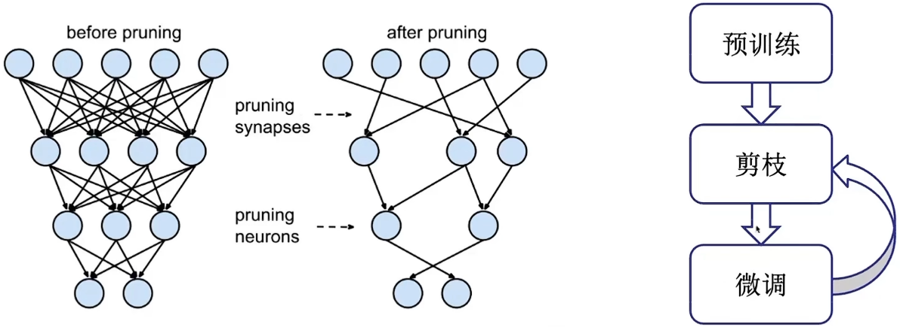
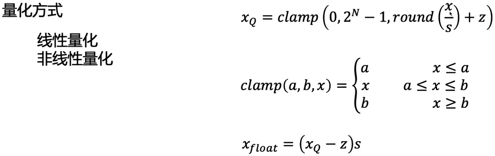
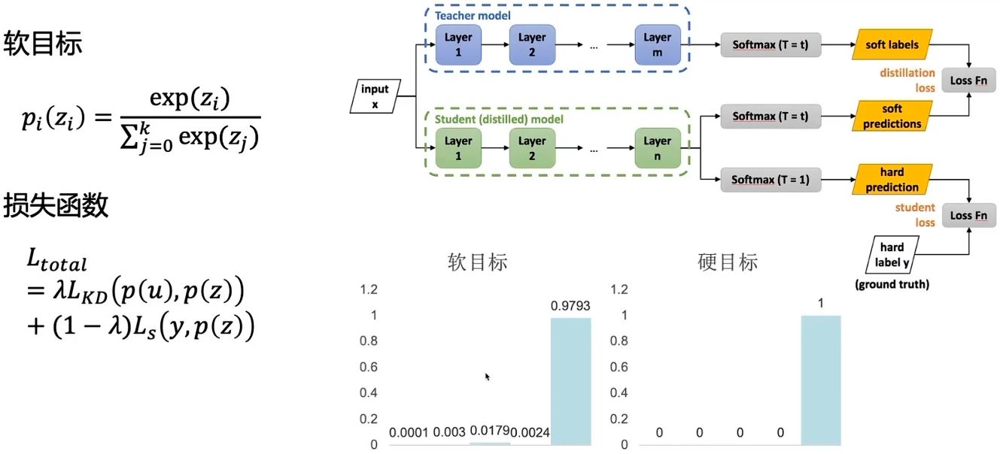
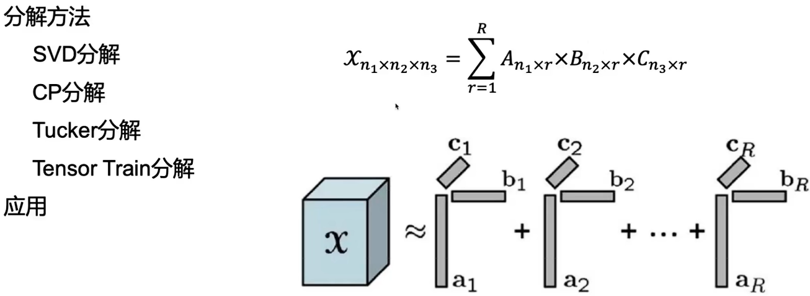
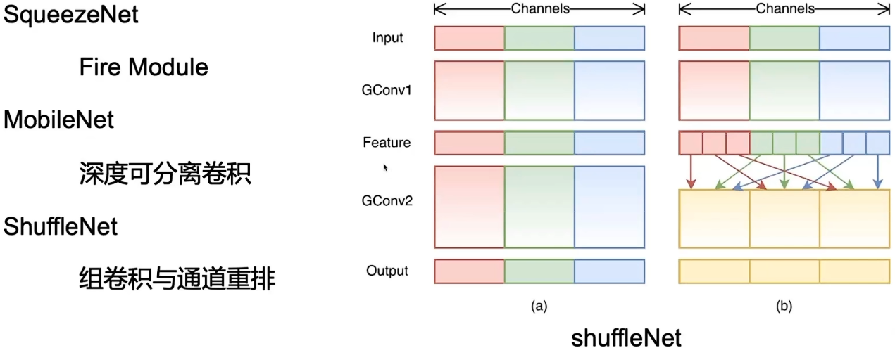
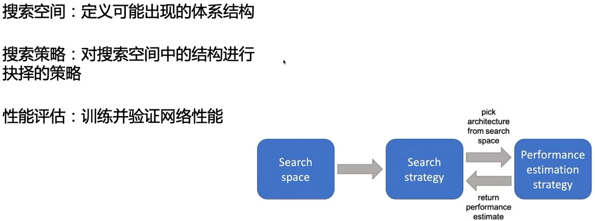

# 模型压缩概述

## 背景

- 为什么要模型压缩？

    端侧设备存在资源限制

- 为什么能模型压缩？

    深度神经网络模型存在冗余性

- 什么是模型压缩？

    利用网络模型冗余性的特点，减小模型规模的方法

## 模型压缩方法

- 剪枝：修剪不重要的网络连接
- 量化：将连续型数据量化为低位宽离散数据
- 知识蒸馏：大模型指导小模型学习
- 低秩分解：通过低秩矩阵近似原矩阵
- 轻量化网络：使用轻量化卷积核代替传统卷积
- 网络结构搜索：自动化地设计优异网络模型

## 剪枝

## 量化

## 知识蒸馏

## 低秩分解

## 轻量化网络

## 网络结构搜索

