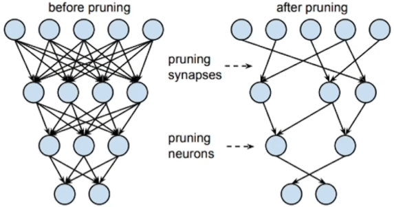
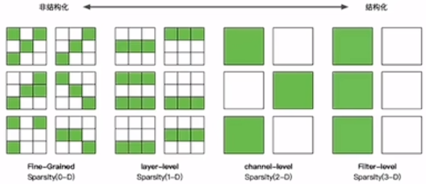
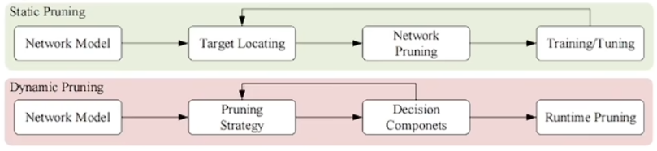
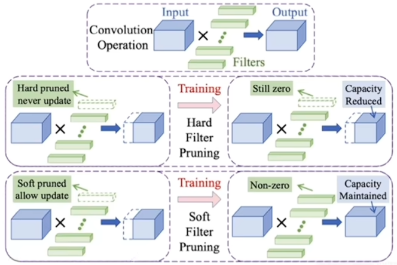
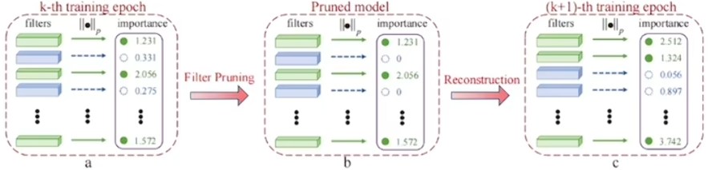

# 模型剪枝

## 1 剪枝简介

过参数化主要是指在训练阶段，在数学上需要进行大量的微分求解，去捕捉数据中微小的变化信息，一旦完成迭代式的训练之后，网络模型在推理的时候就不需要这么多参数。而剪枝算法正是基于过参数化的理论基础提出来的。剪枝算法核心思想就是减少网络模型中参数量和计算量，同时尽量保证模型的性能不受影响。

## 2 剪枝步骤

1. 训练一个模型 → 对模型进行剪枝 → 对剪枝后模型进行微调

2. 在模型训练过程中进行剪枝 → 对剪枝后模型进行微调

3. 对模型进行剪枝 → 从头训练剪枝后模型

### 2.1 训练/剪枝/微调

训练Training：是对网络模型进行训练。

剪枝Pruning：在这里面可以进行如细粒度剪枝、向量剪枝、核剪枝、滤波器剪枝等各种不同的剪枝算法。

微调Finetune：微调是恢复被剪枝操作影响的模型表达能力的必要步骤。

training->pruning->fine-tuning

## 3 结构化剪枝与非结构化剪枝

### 3.1 非结构化剪枝

非结构化剪枝主要是对一些独立的权重、神经元或神经元的连接进行剪枝；属于随机的剪枝，粒度最小。

最简单的方法是预定义一个阈值，低于这个阈值的权重被剪去，高于的被保留。

还有一种方法是使用一个掩码函数来屏蔽权重。在权重更新中可将掩码 $h(w)$ 乘到梯度或权重上，例如一种常见的更新形式为：

$$
\Delta w = -\eta\,\frac{\partial L}{\partial(h(w)w)},
$$

其中 $\eta$ 为学习率，$L$ 为损失函数。

掩码函数 $h(w)$ 逐渐将不必要的权重缩减到 0。给定两个阈值 $a$ 和 $b$（且 $a<b$），可以定义为分段函数：

$$
h(w)=
\begin{cases}
0, & |w| < a, \\
T, & a \le |w| < b, \\
1, & |w| \ge b,
\end{cases}
$$

其中 $0\le T\le 1$ 为中间缩放因子，用于对中等幅值的权重部分保留一部分比例。

### 3.2 结构化剪枝

右边的这三个图是结构化剪枝，结构化的剪枝是有规律、有顺序的。对神经网络（或计算图）进行剪枝时，几个比较经典的方式是：

- 对 Layer 进行剪枝（按层移除或缩减整个层的结构）；
- 对 Channel 进行剪枝（按通道移除或缩减卷积/通道维度）；
- 对 Filter（滤波器）进行剪枝（移除整套卷积核/滤波器）。

剪枝粒度依次增大：Layer < Channel < Filter

在滤波器剪枝中，一种常见的方法是使用滤波器的 $L_p$ 范数（$p=1$ 则为 $L_1$ 范数，$p=2$ 则为 $L_2$ 范数）来评估每个滤波器的重要性。对于第 $i$ 层的第 $j$ 个滤波器 $F_{i,j}$（其形状为 $N_i \times K \times K$），其 $L_p$ 范数可以写为：

$$
\|F_{i,j}\|_p = \left( \sum_{n=1}^{N_i} \sum_{k_1=1}^{K} \sum_{k_2=1}^{K} |F_{i,j}(n,k_1,k_2)|^p \right)^{1/p}.
$$

常用的做法是计算每个滤波器的范数并按范数大小排序或设置阈值，移除范数较小（被认为不重要）的滤波器。

## 4 静态剪枝与动态剪枝

这张图显示了静态剪枝和动态剪枝之间的差异。静态剪枝在推断之前离线执行所有剪枝步骤，而动态剪枝在运行时执行。

### 4.1 静态剪枝

静态剪枝在训练后和推理前进行剪枝。在推理过程中，不需要对网络进行额外的剪枝。静态剪枝通常包括三个部分：

1. 剪枝参数的选择；
2. 剪枝的方法；
3. 选择性微调或再训练。

### 4.2 动态剪枝

网络中有一些奇怪的权重，他们在某些迭代中作用不大，但在其他的迭代却很重要。动态剪枝就是通过动态的恢复权重来得到更好的网络性能。动态剪枝在运行时才决定哪些层、通道或滤波器不会参与进一步的活动。

动态剪枝也存在一些问题：

1. 之前有方法通过强化学习来实现动态剪枝，但在训练过程中要消耗非常多的运算资源。

2. 许多动态剪枝的方法都是通过强化学习的方式来实现的，但是“阀门的开关”是不可微的，也就是说梯度下降法在这里是用不了的。

3. 存储成本高，不适用于资源有限的边缘设备。

## 5 硬剪枝与软剪枝

### 5.1 硬剪枝

在每个 epoch 后会将卷积核直接剪掉，被剪掉的卷积核在下一个 epoch 中不会再出现。

存在的问题：

1. 模型性能降低；

2. 依赖预先训练的模型。

### 5.2 软剪枝

相比较硬剪枝，软剪枝剪枝后进行训练时，上一个epoch中被剪掉的卷积核在当前epoch训练时仍参与迭代，只是将其参数置为0，因此那些卷积核不会被直接丢弃。

一般有四个步骤：

1. 滤波器选择

2. 滤波器剪枝

3. 重建

4. 获得紧凑模型

