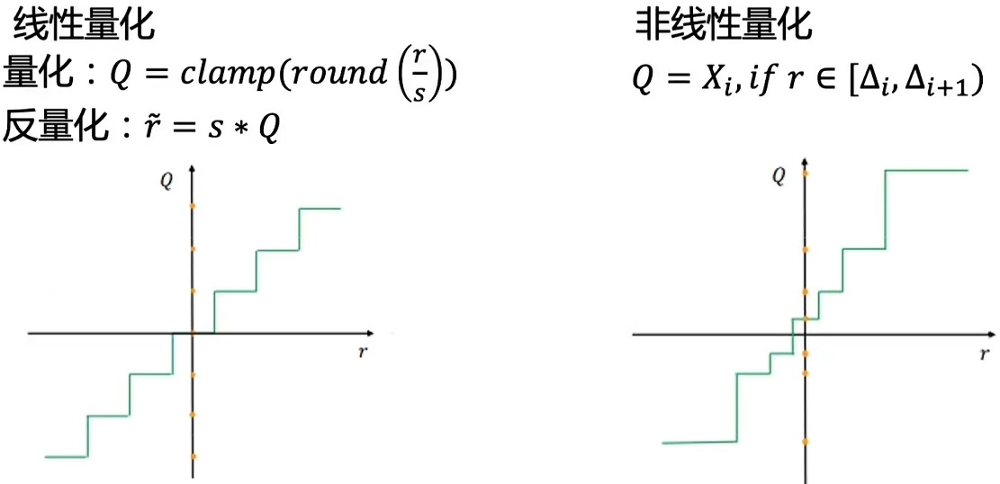
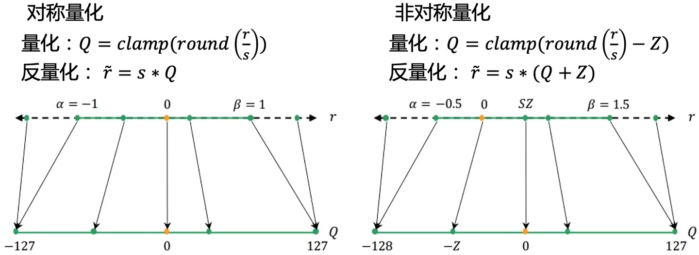
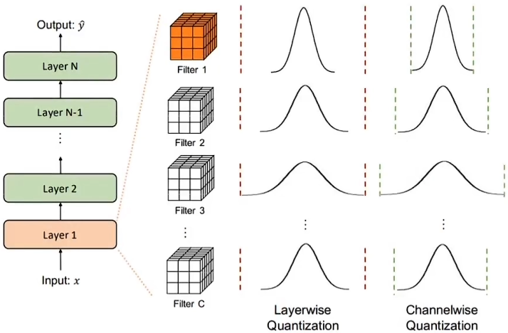
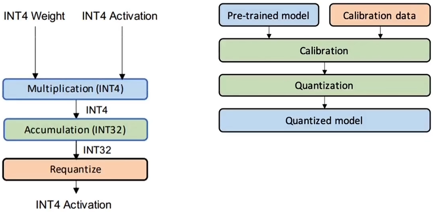
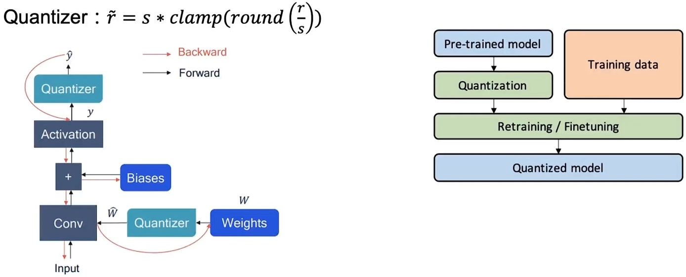
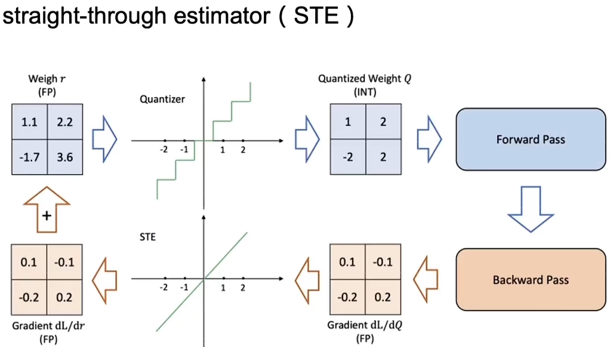

# 模型量化

## 1 量化概念

模型量化是指将神经网络模型中的连续取值的权重或激活值近似为有限多个离散值的过程。

优势：

- 压缩参数
- 提升速度
- 降低内存占用

劣势：

- 模型精度下降

### 1.1 量化分类

- 线性量化与非线性量化：

- 对称量化与非对称量化：

$$
\begin{gathered}
\text{量化粒度} 
\begin{cases}
\text{逐层量化}\\
\text{逐通道量化}
\end{cases}
&&&&&&
\text{量化位宽}
\begin{cases}
\text{统一精度}\\
\text{混合精度}
\end{cases}
\end{gathered}
$$

## 2 量化方式

### 2.1 训练后量化

- 权重量化
  - 量化模型的权重，仅压缩模型大小，推理时先将权重反量化为浮点值。

- 全量化
  - 静态量化：离线计算权重与激活的量化参数。
  - 动态量化：推理时动态计算激活的量化参数。

### 2.2 量化感知训练

通过训练调整量化参数。

## 3 校准方法

量化与反量化常用公式：

$$
Q = \operatorname{clamp}\big(\operatorname{round}(r / S)\big)\\[10pt]

S = \dfrac{\mathrm{threshold}}{2^{\,b-1}-1}
$$

其中 $\operatorname{round}(\cdot)$ 为四舍五入，$\operatorname{clamp}(\cdot)$ 将整数截断到可表示范围；$b$ 为量化位宽。

- 常见校准/量化参数选择方法

    - Global：在整个网络或整个校准数据集上使用统一的最小/最大范围来计算量化参数，简单但可能受异常值影响。

    - Max：对每层或每通道使用观测到的最大绝对值作为范围（min/max），实现简单但对极端值敏感。

    - Percentile：使用激活分布的某一百分位（如 99.9%）作为上界，可以抵抗异常值带来的影响。

    - MSE（均方误差）：选择量化参数以最小化量化-反量化后与原始浮点值之间的均方误差，直接面向重建质量优化。

    - KL‑divergence（熵/信息损失）：通过最小化原始分布与量化后分布之间的 KL 散度来选择量化参数，常用于 logits/概率分布的校准（例如熵校准）。

